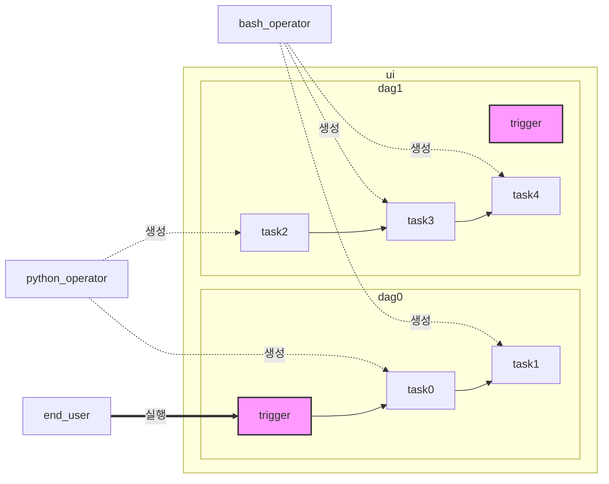

# apache-airflow
## 소개
- [[aws]] step-function 과 유사한 워크플로우 생성툴
- `operator` 라는 단위로 작업 진행 가능
  - [[kubernetes]] 용 확장도 존재 `job` 단위 컨트롤로 추정
  - *argo-workflows* 라는 대안도 존재
- `admin` -> `connections` 에서 변수 관리 가능
- dag 을 만들고 그안에 task 를 붙여서 workflow 를 생성
- task 는 병렬로 실행도 가능
- python script 를 네이티브로 지원
- `xcom_push()` 라는 메서드로 데이터를 전달할 수 있음
- `xcom_pull()` 라는 메서드로 데이터를 받을 수 있음

## flow


## 문법
```sh 
task0 >> task1 >> task2 # 순차 실행
task0 >> [task1, task2] # 순차 후 병렬 실행
```

## 설치
```sh 
AIRFLOW_HOME=~/airflow # airflow 경로 설정, 기본값이라 이 경우는 쓸 필요없음
pip install apache-airflow

# 자동
# airflow standalone

# 수동
airflow db init

airflow users create \
  --username admin \
  --firstname first \
  --lastname last \
  --role Admin \
  --email deptno@gmail.com

airflow webserver --port 8080 # ui 서버
airflow scheduler # 유저가 실행할 걸 스케줄러에 할당하는 역할
```

## 실행
- web 접속 후 
- dag -> run

## 로그 확인
- web 접속 후 
- dag -> run -> event log
- dag -> run -> graph -> task -> 로그 확인
- `logs/` 디렉토리에도 생성됨

## link
- [[ai]]
- [[mlflow]]
- [[fastapi]]
- [[docker]]
- [[n8n]]
