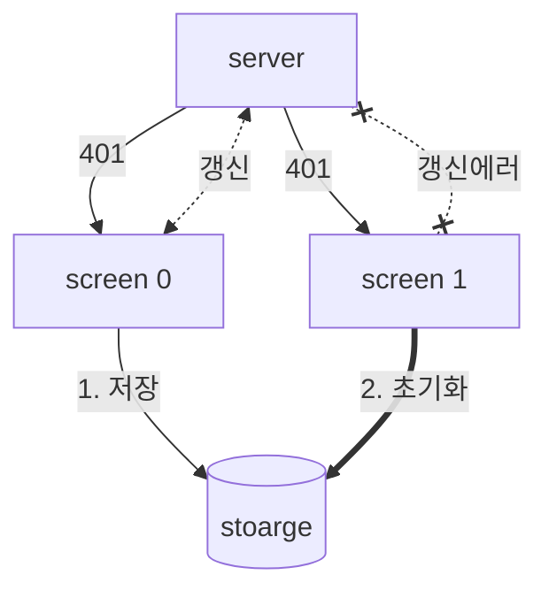

- [X] 구글 로그인 심사
  - [X] 피드백 반영해서 privacy-policy 업데이트, 홈페이지에 개인정보 처리방침 링크
- [O] 안드로이드 플레이 스토어 등록
  - [X] 계정삭제를 웹으로 지원 [[2024-01-24]]
  - [X] ad id
    - [X] 플레이 콘솔 ->  앱 콘텐트 ->  광고 ID -> 사용,  애널리틱스에서 어차피사용되서 포함됨
  - [X] 앱 서명 google playstore 에서 제공하는 키사용 체크
  - [o] 플레이 콘솔 ->  설정 ->  앱 서명, 여기에 나오는 서명키들을 firebase 등에 추가로 등록해야하는지 확인 필요
    - [ ] 앱 서명키 인증서 - 구글에서 추가로 사인을 한 것으로 추측
      - [ ] 업로드키 인증서가 이미 [[../firebase|firebase]] 에 등록되었기 때문에 다른 곳에 등록을 안하면 어떻게되는지 확인 필요하다
      - [ ] 이 것도 firebase 쪽에 등록 필요
      - [ ] `https://[DOMAIN.COM]/.well-known/assetlinks.json` 파일도 교체해야할 것으로 보임
        - [[../deployment|deployment]] 에서 fine mount
    - [X] 업로드키 인증서 - fastlane 에서 업로드할때 로컬에서 sign 한 키가 보여진다
  - [[../fastlane|fastlane]] 배포
    - 최소 한번의 수동 배포가 필요하다
      ```sh 
      - [!] Google Api Error: Invalid request - Package not found: [BUNDLE_IDENTIFIER].
      ```
    - 테스트 ->  내부테스트 ->  업로드 번들에 생성된 `app-release.aab` 파일을 업로드한다.
      - `./gradlew bundleRelease` 를 통해 생성
    - 한번 배포하고 나면 버전 코드 충돌난다고 나온다, 버전코드는 트랙과 무관.
      ```sh
      Google Api Error: Invalid request - Version code 1 has already been used.
      ```
    - 버전 코드를 올린다
      ```sh
      Google Api Error: Invalid request - Precondition check failed.
      ```
    - upload_to_play_store(track: 'internal') 을 주었더니 에러가 다른 에러가 발생
      ```sh
      Google Api Error: Invalid request - Only releases with status draft may be created on draft app.
      ```
    + https://github.com/fastlane/fastlane/discussions/18293
      - 테스트는 내부-internal,  비공개-alhpa, 공개-beta 트랙으로 분류하는것으로 추측
      - 글에 따르면 alpha 이상에서 릴리즈가 수등으로 되어야한다고 말하고 있음
- [X] 앱 개발 과정에 대한 정리
- [[../apple|apple]] 아케이드 체험 등록
- [[../react-native|react-native]] [[../ios|ios]] 는 `Text` 컴포넌트 스타일에 `borderRadius` 가 동작하지않음

---

# 리액트 네이티브 앱 개발 기록
- [[../react-native|react-native]] 를 통해 앱 배포까지의 기록
- 데이터와 관련해서는 기존에 웹으로 제공하고 있던 데이터를 활용할 수 있는 상황에서 시작했다.

## 앱개발의 4 허들
> 프론트엔드 고도화를 하기 전에 아래 4개의 허들을 넘어야한다.  
> 하지만 원하는 앱에 따라 스토어 배포를 제외한 나머지는 선택적이다.

- [[../authentication|authentication]]
  - [[../oauth|oauth]] 인증을 지원하는 경우 [[../apple|apple]] 은 필수적으로 [[../apple|apple]] 로그인을 요구한다
- [[../firebase|firebase]] [[../fcm|fcm]]
  - [[../app|app]] 에서 차별화되는 가장 중요한 서비스중 하나는 [[../push-notification|push-notification]]
  - 이를 위해선 [[../fcm|fcm]] 이 defacto 로 사용되고 있다.
- [[../code-push|code-push]]
  - 선택적이나 앱은 배포이후 문제가 생겼을때 치명적이므로 이에 대한 보험이 필요하다고 생각된다
  - 그 외에도 여러가지 활용폭이 있으므로 [[../react-native|react-native]] 가 주는 강점을 포기할 필요는 없다고 생각한다
- [[../apple|apple]] app store, [[../google|google]] play store 배포
  - code signing 등 모르는 개념에 대해 얕게나마 이해가 필요하다
  - 컴파일이 필요하기 때문에 [[../xcode|xcode]] 나 `build.gradle` 등에 대한 수정도 다소 필요하다
  - 배포를 위해서는 스크린샷등 이미지 준비도해야한다
  - 개인정보 처리방침도 작성해야한다

## 필수 라이브러리들에 대한 학습
- 네비게이션 학습, 네비게이션 없는 앱은 존재할 수 없다
  - `react-navigation` 
- 스플래시 스크린 혹은 런치 스크린이라 불리는 로딩 화면 처리
- [[../push-notification|push-notification]] 을 받아야하므로 이에 대한 처리
  - `@react-native-firebase/*`
  - `@notifee/react-native`

## 배포 자동화
- 완전히 선택적인 옵션이기 때문에 허들이라 할 순 없다.
- 다만 지속적인 업데이트를 통한 생산성을 확보하고자 한다면 도움이 될 것
- [[../fastlane|fastlane]] 을 통한 자동화 또한 다소 코드 작성이 필요했다.
- [[../ruby|ruby]] 언어 기반이기때문에 조금 찾아보면서 작업을 해야한다
- 사실 이런 부분도 secret 관리를 그냥 코드에 때려밖는다고한다면 상당히 단순화된다

## 개발 과정
- 라이브러리들이 네이티브를 포함하기 때문에 다소 설정이 들어가는것이 일반적이다.
- [[../react-native|react-native]] 는 자바스크립트 환경이지만 runtime 이 다르므로 global 객체가 있을 것이라고 가정해서는 안된다
  - `URLSearchParams` - 얜 `polyfill` 이 있어서 다행
  - `Intl` - 상대시간 표기를 한글로 하고싶었는데 얘가 없어서 정규표현식을 통한 변환 처리했다
- [[../react-native|react-native]] [[../app|app]] 을 개발하면서 모르는 [[../app|app]] 의 개념, 환경을 받아들이는고 설정하는데 많은 시간이 소요
  - [[../xcode|xcode]]
  - [[../pod|pod]]
  - [[../gradle|gradle]]
  - [[../fastlane|fastlane]]
- 처음에는 하이브리드 앱을 생각했으나 full [[../webview|webview]] [[../app|app]] 이 아닌이상 인증처리가 더 복잡한 문제가 있어 native 로 전환
  - 미세하게 느껴지는 퍼포먼스 혹은 느낌의 차이
  - 401 처리를 앱과 네이티브 두영역에서 해야하다보니 전파의 이슈
  - single [[../webview|webview]] 가아닌 multi [[../webview|webview]] 이다보니 이 또한 전파의 이슈를 깊게 고민해야했다
    ```mermaid
    flowchart
      server --401--> native
      native <-.갱신.-> server
      native --token--> wv0[webview 0]
      native --token--> wv1[webview 1]
      native --token--> wv2[webview 2]
      native --token--> wv3[webview 3]
    ```
    ```mermaid
    flowchart
      server --401--> wv1
      wv1 <-.갱신.-> server
      wv1 --token--> native
      native --token--> wv0[webview 0]
      native --token--> wv2[webview 2]
      native --token--> wv3[webview 3]
    ```
    ```mermaid
    flowchart
      server --401--> wv1
      wv1 --token--> native
      native <-.갱신.-> server
      native --token--> wv0[webview 0]
      native --token--> wv2[webview 2]
      native --token--> wv3[webview 3]
    ```
- 추후 웹까지의 서비스 확장을 위해 next-auth 기반으로 구현을 하다보니 여기서 시간이 꽤나 소요되었다
  - next-auth 는 rn을 지원하지 않으나 이를 커스텀하여 중간에 같은 로직과 테이블 구조를 사용하고자 했다
  - native 로 전환을 하고자하니 next-auth 는 쿠키기반이라 이를 헤더기반으로 풀기위해서 시간이 소요
    - 이를 위해 코드를 일부 떠와야했고 패스워드없는 이메일 기반 로직등을 추가로 구현
- navigation 에 종속적이므로 코드 구조 또한 선택한 [[../react-navigation|react-navigation]] 에 맞춰줘야하는 경향이 있다.
  - 옵션이 많이 있었고 [[../ios|ios]], [[../android|android]] 간에도 잘 동작해서 어려움이 없었다.
- 로그인을 지원하는 [[../app|app]] 은 로그인이 풀리지 않는 것이 중요하므로 **refresh token** 을 통한 갱신이 필수적이므로 이에 대한 구현을 공통화 해서 잘처리해야한다
  - 앱이 background 에 있다가 foreground 로 올라왔을때 연속적인 api call 이 발생하여 401 이 중복으로 발생하여 생긴 문제가 있었다.

- 직접 [[../fcm|fcm]] 토큰을 [[통해서push-notification]] 을 발행할 수도 있지만 topic 을 통해서 전송도 가능하다.  이 경우 한글을 지원하지 않아 인코딩이 필요했다.

## 툴 활용
- ipad 의 *procreator* 를 사용해서 플레이 스토어에서 요구하는 그래픽 이미지(1024x500) 에 대한 문구 처리를 했다
- `react-native-bootsplash` 라이브러리에서 스플래시 스크린에대한 요구사항 처리

### 웹 서비스
+ [[../dev-tools|dev-tools]]  
- [[../midjourney|midjourney]] 를 통해 작성된 아이콘을 여러 사이즈로 변환
  + https://easyappicon.com
- 인터넷에 공개된 figma 템플릿을 활용해서 스토어에 필요한 이미지들을 작성

### 생성 [[../ai|ai]]
- 스플래시 스크린과,  앱 아이콘 및 몇가지 앱 내 로고 처리를 [[../midjourney|midjourney]] 를 통해 작성했다
- 개인정보 처리 방침 작성
  - [[../chatgpt|chatgpt]] 에게 앱이 하는 일과 수집하는 정보를 설명하고 작성해달라했다
  - appstore 통과, playstore 는 아직 google 로그인 허가 안떨어져서 대기중이다
  - google 로그인에서는 개인정보 처리방침이 부족하다는 피드백이었다.

## 후기
- [[../react-native|react-native]] 를 사용하고 있는만큼 웹 개발과 그다지 이질감은 없다.
- 다만 위에 정리한 4허들이 존재한다
- [[../push-notification|push-notification]] 경우는 멀티디바이스를 지원할 것인지와 같은 고민포인트 들이 있다. 트레이트드 오프가 필요하다.
- 첫 app 개발에 대해서는 설정등에 대한 부담이 강하나 두번째 개발부터  더 빠르게 개발이 가능할 것으로 생각한다

## git commit 분석
- 커밋으로 의미있는 타임라인을 추출하지는 못했다.
  - 일 자체를 선형으로 하지 않고 앱, 웹서버, 알림서버 등을 동시에 처리했기 때문
  - 그외에도 삽질이 너무 많았고, 되돌리는 경우도 많았다

### 2023-w49, 2023-12-03
- web
  - 서버 + [[../yarn|yarn]]@4
- app
  - [[../react-native|react-native]] 프로젝트 생성 + [[../bun|bun]]
  - [[../react-navigation|react-navigation]] 설정
  - [[../webview|webview]],  인앱브라우저

### 2023-w50, 2023-12-10
- web
  - 배포 +  [[../docker|docker]] build 스크립트
  - [[../nextjs|nextjs]] standalone 위해 [[../yarn|yarn]] cache 튜닝
  - 도메인 + ingress 설정
  - logger 설정
  - [[../next-auth|next-auth]] 설정
    - 인증 데이터를 위한 table 생성
  - 로그인 스크린 구현
  - 구글 로그인 flow 구현
- app
  - 테스트 스크린 구현
  - 커스텀 타입처리를 위한 `global.d.ts` 추가
  - 구글 로그인 패키지 설정
  - email 로그인을 위한 sendgrid 설정
- firebase 프로젝트 설정 시작

### 2023-w51, 2023-12-17
- web
  - email 로그인 flow 구현
  - assetlinks.json 추가
- app
  - 딥링크 처리
  - react-native-permission 추가
  - @react-native-firebase/* 추가
  - notifee 추가
  - react-native-url-polyfill 추가

### 2023-w52, 2023-12-24
- app
  - react-native@0.73.1
  - apple 로그인
  - ios deeplink 설정
  - ios 실기기에서 테스트시 localhost 처리 못하는 문제를 git stage 를 활용해서 처리
- 배포
  - fastlane 을 이용해 firebase app distribution 배포

### 2024-w01, 2023-12-31
- web
  - next-auth 커스텀 처리를 위한 soft-fork 및 디버깅
  - fcm 테이블 생성 및 토큰 저장
- app
  - xcode remote push 활성화 및 테스트
  - android react-native-config + proguard 충돌 이슈 처리
  - react-native-async-storage 추가
  - firebase anlytics, crashlytics, app-check 추가
    - app-check 제거
  - android 에서 appsignin 로직 분리 제거
  - 키워드 관리 구현
  - react-navigation 타입 주입
  - 웹뷰 통신을 통한 로그인 구현
  - safearea 적용
- 배포
  - fastlane 을 이용해 android 로컬 디바이스에 복사처리

### 2024-w02, 2024-01-06
- refresh token 로직 구현
- 피드화면 구현
- 401 + refresh token 재 인증 구현
- 등록된 키워드에 맞춰서 푸시 발송 구현
- 푸시를 받아서 알람 띄우기 구현
- 알람 누른경우 딥링크 처리 로직
- 내 피드 스크린 구현
- 키보드내려가는 로직 처리
- 스플래시 스크린 추가

### 2024-w03, 2024-01-13
- react-native@0.73.2
- fcm 토픽이 한글지원을 하지 않아서 인코딩
- 키워드 검색 구현
- 로그인 화면 앱으로 재구현
- 웹서버 yarn -> pnpm 으로 마이그레이션
- 아이콘 변경
- android 빌드 환경 분리
- 바탐탭 active 색상 적용
- 바탐탭 alarm 카운 표시
- code-push 적용
- ui, 시간 포맷 적용
- 환경에따른 .env 로드 분리
- email ui 처리
- lottie 적용
- 로고 적용
- 로그인에 따른 애널리틱스 속성 설정

### 2024-w04, 2024-01-20
- 스크린 계정 조정
- 헤더 추가
- 종료딜 표시
- 배포
