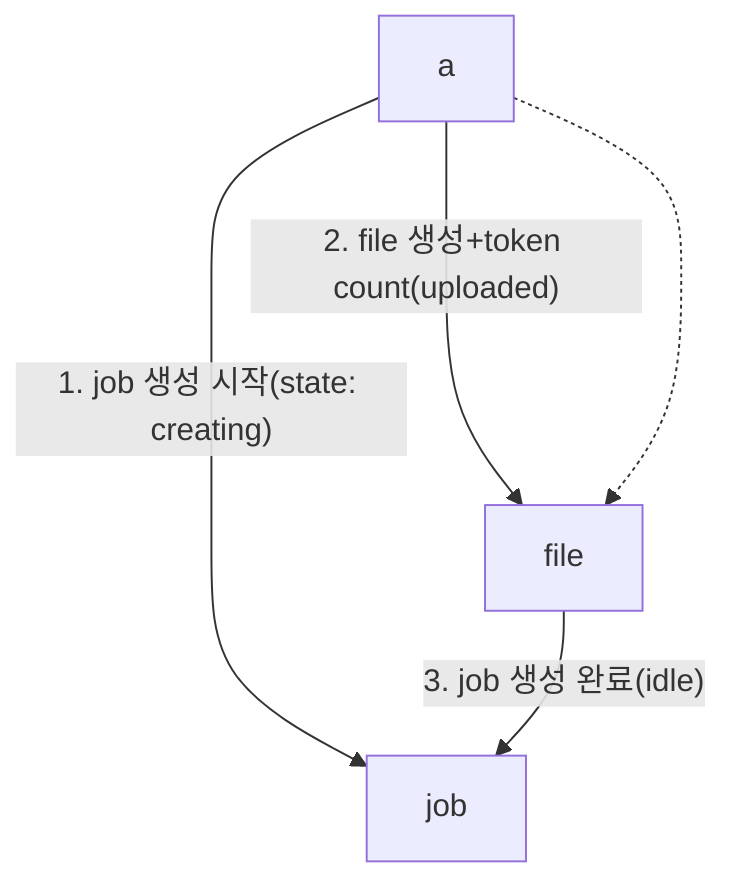
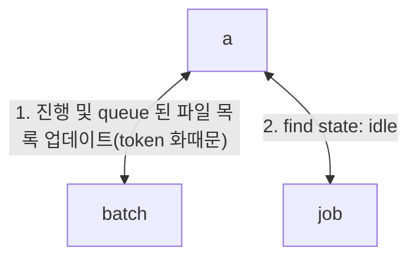

- [[../openai-api]]
  - 글 작성 시점 tier 1
  - batch api
    - prompt cache 가 적용되지 않음
      - batch 결과 파일에서는 그렇게 나왓으나 usage 에서는 cache가 동작하는 것으로 보임
      - cache eviction 이 peek time 때 더 자주일어남, 이 시간을 피하면 hit 율을 올릴 수 있음
      + https://platform.openai.com/docs/guides/prompt-caching#frequently-asked-questions
      + https://openai.com/api-scale-tier/
    - batch api 는 요청이 아닌 전체 queue 를 기준으로 대기 걸려있는 input 들의 token 수가 `2,000,000` 을 넘길 수 없음
  - file upload 는 200MB 제한
  - 대충 1600 token 소비하는 작업 1000개 기준의 batch 로 $0.13, output $0.01 소모, 시간은 30분 안에 처리됨
    - 30분안에는 배치 작업을 못걸어 둔다는 말
    - m1 max 64, mistral-small 24b 모델로 작업시 throughput 이 18/m 이 나옴 대충 18*60 = 1080, 1시간 소모
    - 동일 모델을 rtx3080 10g 에서 돌리니 throughput  12/m, 대충 85분, 메모리 부족 이슈일듯
  - 제대로 된 작업을 하려면
    - file uplaoder
      - 배치는 실패할 수 있으므로 파일을 먼저 토큰과 사이즈 제한에 맞춰서 생성후 업로드를 먼저 진행
        + [토크나이저, 토큰 계산](https://platform.openai.com/tokenizer)
      - 작업단위에 링크된 파일들 목록을 table 로 관리
      - 작업단위에 링크된 파일들 목록을 table 로 관리
    - batch polling woker 필요
      - table 에 batch 상태를 모니터링하여 업데이트 하는 역할
      - queue 상태를 보고 업로드된 파일들로 배치 진행
    - ddl
      - job
      - file - job_id 참조 n-1
      - batch - file_id 참조 1-1

