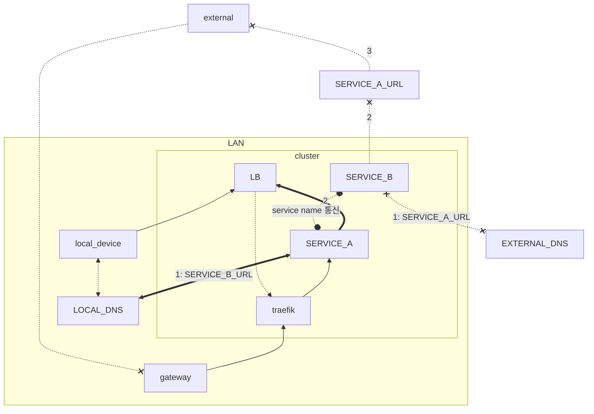

- [[../codex|codex]] + [[../github-action|github-action]]
  - 원하는 바 codex cloud 를 통해서 작업 지시 -> codex/** 브랜치로 pr 올라옴
  - [[../ci|ci]]
  - [[2025-10-10]] 어제 작업한 내용으로 [[../self-hosted|self-hosted]] runner 로 [[../kubectl|kubectl]], [[../docker|docker]] private repository push 진행
    + [[../harbor|harbor]]
  - [[../docker|docker]] build 시에는 tag 를 미리 정해둔 codex-pr 과 같은 형태로 push
  - [[../deployment|deployment]] 는 manifest yaml 을 통해 apply, 이때 이름은 미리 정해둔 codex-pr 과 같은 이름이 그대로 사용
  - service, ingressroute 는 미리 배포해 두어야함
  - codex 작업을 공개 url을 통해 확인
- [[../metallb|metallb]]@0.15.2
  - [[../kubernetes|kubernetes]] load balancer 설정
  - traefik 을 로컬에서 접근할때는 로컬에서 접근하는 것이 목적
    - 공유기에서 NAT loopback 미지원
  - 동일 url https://wiki.deptno.dev 를 접속한다 가정할때 내부에서는 내부 dns로 밖으로 나가지않고 바로 접근하도록 하는 목적
    - [[../dns|dns]]
      - local [[../dns|dns]] 에서 *.deptno.dev 를 loadbalancer 로 돌린다
  - 트래픽이 나갔다 들어오지 않는 않도록 하여 트래픽 절약 및 랜 내부에서의 속도를 풀로 활용하는 목적

