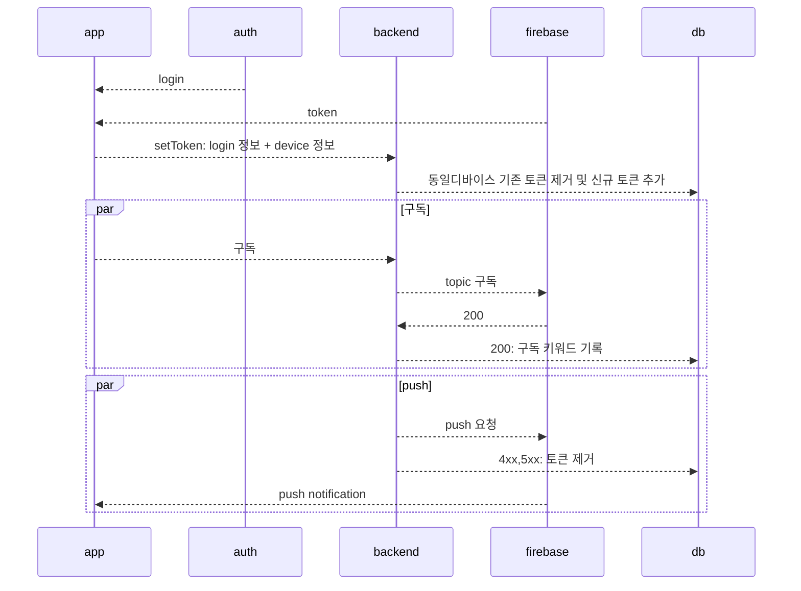

# fcm
firebase cloud message

## overview
+ https://seungwoolog.tistory.com/88 참조

## 사용패턴
- notification
- data sync
  - [ ] 활용패턴이 있을 것 같음 특정 ui 버전을 보게 한다던가, de-feature 해버린다던가
- updating ui

## 사용
- 프로젝트생성
  + https://console.firebase.google.com/u/0/?hl=ko
- 프로젝트화면에서 *앱에 Firebase를 추가하여 시작하기* 를 통해 [[iOS]], [[android]] 관련 설정
- [[android]] 앱에 Firebase 추가
  - 패키지 네임 [[react-native]] 프로젝트 기준으로 `android/app/build.gradle` 확인
  - 및 디버그 서명 인증서 SHA-1 은 [[keytool]] 을 통해 정보 확인
  - 확인 된 정보로 앱등록 -> google-service.json 다운로드 -> android/app 폴더에 추가
- client
  + https://rnfirebase.io/messaging/usage
- server
  + https://rnfirebase.io/messaging/server-integration

### client
- *중요* 백그라운드 메시지 처리에 제약사항으로 인해 코드가 로딩되는 이른 시점에 firebase 설정이 되어야한다
- [[ios]] 는 백그라운드에서 메시지를 받았을때 리액트 루트가 마운트되며 이로인한 문제를 방지하기 위한 설정이 필요하다
  + https://rnfirebase.io/messaging/usage#background-application-state

#### firebase.json
> 추가 설정을 위해서 자동으로 해주는 것들을 `disabled` 시키는 등, 특정 설정 가능
- [[ios]]
  - disable APNs auto registration
  - foreground presentation options - notification 보여지는 방식
- [[android]]
  - background handler timeout 설정, background, quit 상태에서 메시지를 핸들링할 타입지정 ->  지나면 앱 quit으로 추정
  - Notification Channel ID
    - [ ] 학습 필요 [[@todo]]
  - Notification Color
- Auto initialization

#### app 의 상태따른 행동
- 상태
  - foreground
    - `messaging().onMessage()`
  - background
    - `messaging().setBackgroundMessageHandler()`
  - quit - 종료된 경우
- 상태에 따라 다르게 행동하게되며 이해가 중요하다고 함 읽어볼 것
  + https://firebase.google.com/docs/cloud-messaging/concept-options?hl=ko

#### 메시지 타입
> data only 메시지는 low priority 로 간주되며 앱을 깨우지 않는다,  우선순위를 강제하면 깨울 수 있다
- data + notification
- data

### server
+ https://firebase.google.com/docs/cloud-messaging/ios/first-message?hl=ko
+ https://rnfirebase.io/messaging/server-integration
- 메시지를 보내는 방식
  - 메시지를 특정 디바이스에 보내는 방식
  - 메시지를 토픽에 발송하는 방식
    - 토픽을 구독하는 주체는 앱
    - 서버가 토픽에 메시지를 발송(한번에 최대 5개 토픽)
    - *주의*  특정 유저를 위한 토픽을 만들지 말것
    - [ ] [[@todo]] 많은 유저가 구독중인 알람으로 인한 서버부담을 줄이고자 유저를 토픽 유저를 그룹으로 나눠서 시간차로 보낼 수 있는지 확인
- [[ios]]
  - [[firebase]] 프로젝트 설정에서 [[APNs]] 등록 필요
  - [ ] [[xcode]] 에서 push 활성화 필요할 것

### rest 
#### fcm access token 발급
- oauth 토큰이 필요하다 아래서 발급이 가능하다
  + https://developers.google.com/oauthplayground/
    + https://stackoverflow.com/questions/50399170/what-bearer-token-should-i-be-using-for-firebase-cloud-messaging-testing
    - [X] Firebase Cloud Messaging API v1

#### 사용
- vim rest 형태니 알아서 변경해서 쓴다
  ```sh 
  https://fcm.googleapis.com

  Content-Type: application/json
  Authorization: Bearer [위에서 발급받은 accessToken]

  POST /v1/projects/saljiro/messages:send

  {
    "message": {
      "data":{
        "deepLink":"myscheme://path",
      },
      "notification":{
        "body":"1",
        "title":"leserrafim"
      },
      "token" : "[발송 대상의 fcm token]"
    }
  }
  ```

## 언급되는 라이브러리
- https://github.com/invertase/notifee
  - android notification ux 까지 변경지원하는 것으로 언급됨
  - 이전에 사용되던 https://github.com/zo0r/react-native-push-notification 는 버전 업데이트 멈춘듯 2021-10-01

## 구현
- 유저의 디바이스가 여러개일 수 있으므로 user, token 관계는 **1:n** 
- 로그인을 가정


## link
- [[firebase]]
- [[iOS]]
- [[android]]
- [[react-native]]
- [[apns]]
