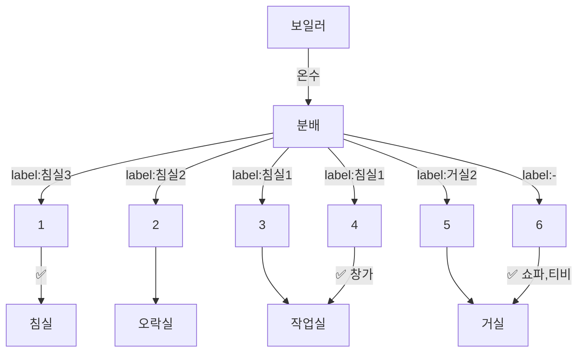

# home
Welcome to the [[deptno.dev]]!

## 통신 배선
- cat5e 로 배선됨
- 🟢 랜테스터기로 확인: 4 페어 모두 살아있음
- 🟡 랜테스터기로 확인: 3 페어 체크됨
```mermaid
flowchart TD
  통신단자함 --> 메인허브
  메인허브 <-. 메인회선 .- 0
  메인허브 --> 1
  메인허브 --> 2
  메인허브 --> 3
  메인허브 --> 4
  메인허브 --> 5
  메인허브 --> 6
  메인허브 --> 7
  인터넷 ----> 0
  1 -- "🟢0" --> 침실
  1 -- "🟢1" --> 침실
  2 -- "🟢0" --> 오락실
  2 -- "🟢1" --> 오락실
  3 -- "🟢0" --> 작업실
  3 -. "🟡1" .-> 작업실
  4 -- "🟢0" --> 거실:티비
  4 -. "🟡1" .-> 거실:티비
  5 -- "🟢0" --> 거실:쇼파
  5 -- "🟢1" --> 거실:쇼파
  6 -- "🟢0" --> 거실:식탁
  6 -- "🟢1" --> 거실:식탁
  7 -- "🟢0" --> 거실:주방
  7 -- "🟢1" --> 거실:주방
```

## 보일러 배관
- ✅ 확인됨


## link
- [[smarthome]]
- [[me]]
