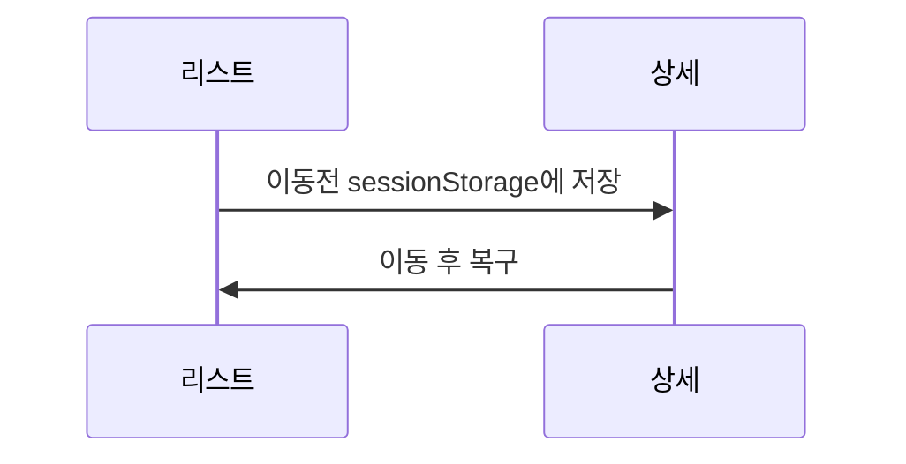

# infinity-scroll
매번 구현해야해서 정리

## 개념

- 전제 조건
  - 이전의 위치로 갈 수 있을만큼, 그리기 위한 데이터가 존재해야한다
    - 캐시
      - `react-query` or `swr` 등을 사용
    - 페이지 페이지 이동에 영향을 받지 않는 글로벌 스테이트에 기반한 리스트 아이템
      - zustand 등을 사용해서 직접 구현
- 최적화
  - 스크롤이 길게된 상태면 너무 그려진 아이템이 많아서 퍼포먼서 저하가 일어나게된다
    - 보일때만 그린다
      - 이 또한 IntersectionObserver 등을 사용해서 각각의 엘리먼트 이벤트를 모니터링해야하므로 퍼모먼스 측정이 필요하다
      - 혹은 다른 방법
      - 이런 것 까지 구현할 시대는 아닌듯
  - 클릭하면 새창에서 열어버리는게 사실 깔금, 모바일에서도 이런 경우 심리스한 뒤로가기를 지원

## 구현
> 포지션 저장 복구는 네비게이션 이동에 따른 상황을 처리하기 위함인데, 백키로 할 경우는 브라우저에서 처리하는 것으로 보이고 이게 더 명확하게 느껴진다  
> 이때 전제조건은 캐시가 존재하여 이를 복구할 수 있는 경우에 한정된다
### 스크롤 포지션 저장
```javascript
sessionStorage.setItem(location.href, window.scrollY.toString())
```

### 스크롤 포지션 복구
```javascript
useffect(() => {
  const y = sessionStorage.getItem(location.href)

  if (y) {
    const y = sessionStorage.removeItem(location.href)
    const top = Number(y)
    if (top) {
      window.scrollTo({ top })
    }
  }
}, [])
```

### react-query
- 작성 시점, ssr 에서 처리를 처리가 어려운 것으로 보여 드랍 [[diary:2024-03-02]]

### swr
- `useSWRImmutable` 훅을 통해 parameter 에 따라서 불편하는 쿼리를 쉽게 캐싱

### 구현 순서
- [[wip]]
- ssr 타이밍에 list 를 그린다, 초기 리스트라서 커서가 없을 수 있다.
- 리스트의 마지막 아이템은 클라이언트 컴포넌트로 작성한다, <ServerItem />, <ClientWatchItem />
  - `IntersectionObserver` 를 통해 <ClientWatchItem /> 이 노출되는 경우 <ClientList /> 를 **함께** 그린다
- 마지막아이템이 노출되는 경우 패치를 시작하고 패치에 따라 데이터를 그린다
  ```javascriptreact
  if (isShow) {
    return (
      <>
        <ServerItem>
        <ClientList/>
      </>
    )
  }

  return (
    <ClientWatchItem ref={refForWatch}>
  )
  ```


## link
- [[frontend]]
