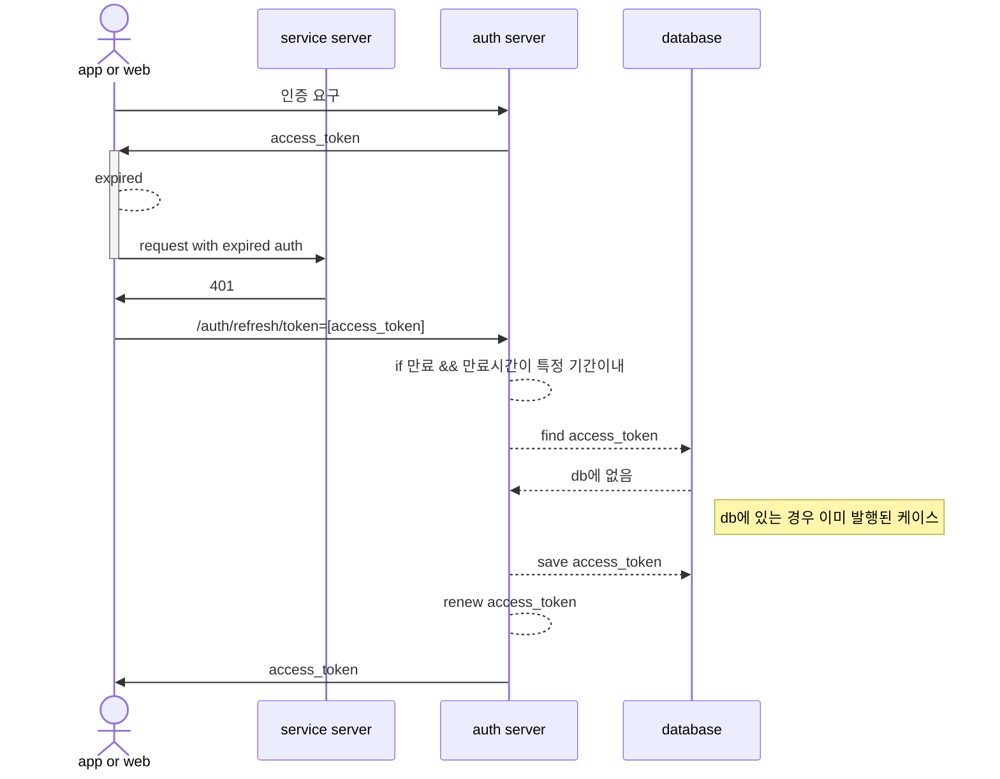

# jwt
JSON Web Token

## 질문
### jwt 를 사용할때 refresh token 이 필요한지?
- 아래와 같은 형태의 사용도 가능하지 않은가?
1. jwt 토큰은 expire 이후에도 decode 자체는 가능하다
2. 만료된 token 을 decode 해서 expire 된 시간을 확인한다
3. 발급**했어야 할** refresh token 의 expire 기간내라면 access token 을 갱신한다
- 위와같은 시나리오는 access token 의 expire 기간을 refresh token 과 같게한것과 같다
- refresh token 은 서버가 아니라 신뢰 클라이언트에 저장되어야한다
  + [[oauth#신뢰, 비신뢰 클라이언트 인증]]
- 안전하게, 만료된 access token 에 만료시에 해당 access token에 대해서 **한번만** 갱신이 가능한 refresh token 을 만들기 위해서는 [[jwt]] 로 만들어서는 안될 것으로 생각된다
  - jwt 는 revoke 가 불가능하기 때문
  - 때문에 이를 성취하기 위해서는 [[jwt]] 를 사용하더라도 db에 저장후에 사용(아무 해시와 다를게 없이 사용)되면 파기하는 방법으로 사용되는게 안정성이 높을 것으로 생각된다
- 이를 분리하는건 탈취에 대한 방어인데 access_token 과 refresh_token 을 같은 비신뢰 저장소에 저장해 둔다면 동일하게 탈취되므로 의미가 없다
- 구현이슈는 복잡하고 생각할게 많으므로 [[mvp]] 를 구현하는데 방해가 될 수 있으므로 보안 요구사항을 생각하고 진행하는 것이 좋겠다

#### refresh token 구현 아이디어
- 클라이언트에 저장 하지 않고 access token 에 대해서 한번만 발생할 수 있는 refresh token 발급 api 를 생성한다

  - 이런 구현인 경우 만료된 토큰을 가지고 /auth/refresh 를 지속적으로 요구하면 db 가 지속되어 기존 스펙보다 나은게 없는 것 같다
  - refresh token 을 함께 발급하고 이를 안전한 저장소에 클라이언트에 저장하는게 요구사항인만큼 이것이 관철되는것이 좋을것으로 생각한다

## link
- [[oauth]]
- [[jwe]]
