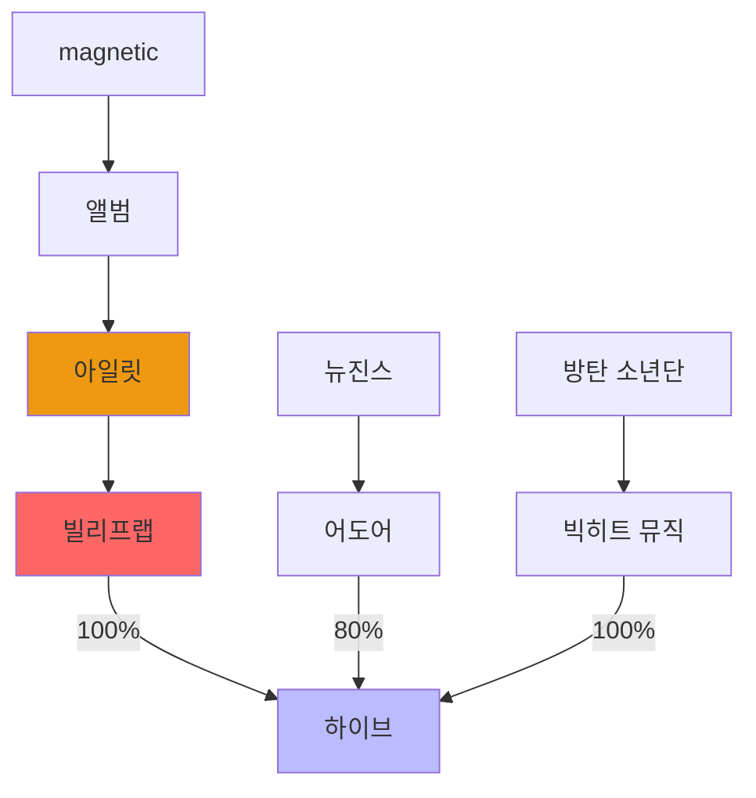

# kpop
## data
### 관계도

+ https://namu.wiki/w/한국%20아이돌/목록
+ https://namu.wiki/w/연예%20기획사

### 아티스트 계약기간
- 재계약 이슈
- 재계약시 인기도에 따라 아티스트의 몸값이 상승함

### 군대

### 지분율
- 기획사 -> 레이블

### 기여도
- 아티스트 -> 레이블

### 차트
- 빌보드 100(싱글)
- 빌보드 200(앨범)
- 오리콘
- 서클차트 - 다양한 차트가있는데 주별로 받아서 합산을 해야한다
- 한터차트(초동)

## link
- [[project]]
