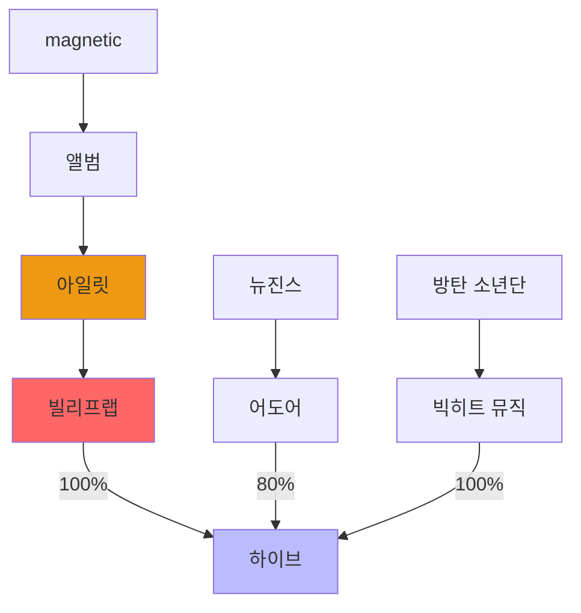

# kpop
## data
### 관계도

+ https://namu.wiki/w/한국%20아이돌/목록
+ https://namu.wiki/w/연예%20기획사

### 아티스트 계약기간
- 재계약 이슈
- 재계약시 인기도에 따라 아티스트의 몸값이 상승함

### 군대
- 병역문제
- 입대 <-> 전역

### 지분율
- 기획사 -> 레이블

### 기여도
- 아티스트 -> 레이블

### 차트
- 빌보드 100(싱글)
- 빌보드 200(앨범)
- 오리콘
- [[circlechart|서클차트]] - 다양한 차트가있는데 주별로 받아서 합산을 해야한다
- 한터차트(초동)
- [[youtube]] 차트

#### 참고
- [[youtube]] 아티스트 순위와, [[circlechart]] 의 social chart 순위가 다름
- 한터차트와 [[circlechart]] 의 retail album 차트를 비교하면 데이터가 다르다, 초동은 한터 차트를 중심으로 보는 것 같다

### 유튜브
- 구독자 상승폭
- 뷰 상승폭
  - 곡별

### 앨범
- 앨범 발매 및 활동기간

### SNS
- instagram
- x
- 위버스?
- 이것도 늘어나는 폭이 중요할 듯

### 게시판
- dcinside
- naver stock, 의미는 별로 없음
- 더쿠?

### 검색엔진
- naver trends
- google trends

### 공시
- dart
- 주식 애널리티스의 분석

### 주가
- 4대 기획사에 대한 분석

### 기타
- 활동 아티스트 증가에 따른 전체 파이와 팀킬 여부

## mvp
### 데이터 자동화 우선순위
1. chart
2. youtube

### 수동
- 아티스트 <-> 레이블 <-> 소속사 관계
- 앨범 발매일, 활동기간

## link
- [[project]]
