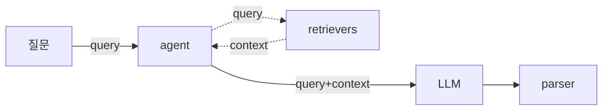

# langchain

## 기본 흐름

- retriever 는 도구나 검색을 추상화
  - vector-db 를 두고 유사도 검색등이 여기서 행해진다
  - vector 화 를 하기 위해서는 사용하는 모델의 embedding 을 거쳐야한다
- agent 는 질문을 받아 retriever 를 사용할지 여부를 판단하고 그 결과를 `context` 에 취합

## link
- [[javascript]]
- [[python]]
- [[milvus]]
