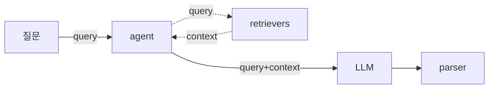

# langchain

## 기본 흐름

- retriever 는 도구나 검색을 추상화
  - vector-db 를 두고 유사도 검색등이 여기서 행해진다
  - vector 화 를 하기 위해서는 사용하는 모델의 embedding 을 거쳐야한다
- agent 는 질문을 받아 retriever 를 사용할지 여부를 판단하고 그 결과를 `context` 에 취합

## embed
- data를 벡터로 변환하며 모델에 의해 수행된다

### cache
- text embed 시에 text 를 hash 로 하여 key-value store 에 저장하여 중복 임베딩을 막는다
- [[redis]] 등이 사용된다

### rate limits
- model 서비스의 제약을 넘어서면 에러가 발생하므로 동시 리퀘스트 제한 기능을 제공한다
```javascript 
new OpenAIEmbeddings({ maxConcurrency: 5 })
```

### timeout
- model 의 임베딩 기본값은 무제한이므로 타임아웃 설정을 통해 에러를 발생시킬 수 있다.
```javascript 
new OpenAIEmbeddings({ timeout: 1000 })
```


## link
- [[javascript]]
- [[python]]
- [[milvus]]
