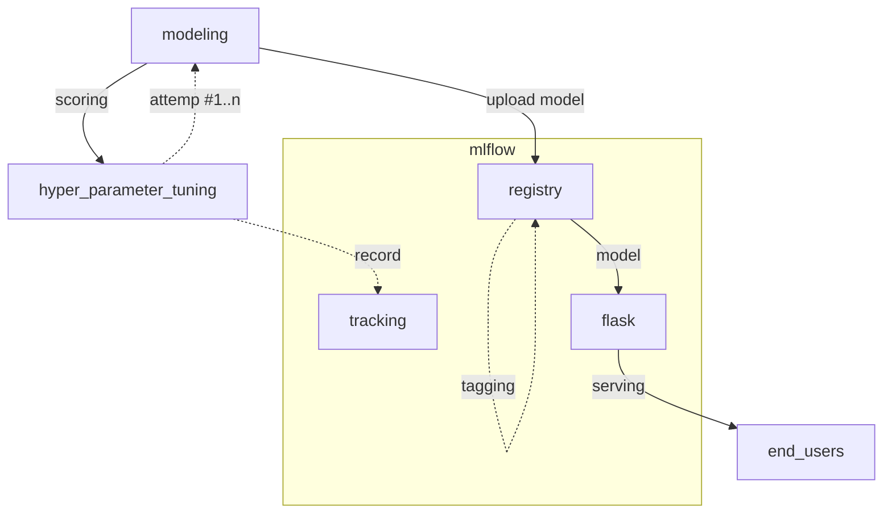

# mlflow
- 튜닝 하이퍼파라메터 관리
  - 반복적인 작업이 많은 하이퍼파라메터등을 기록 및 시각해주면서 트래킹이 가능
- 모델
  - 모델에 등록하면 rest api 를 통해 inference 가능
- 모델 레지스트리 관리
  - 모델의 버전 관리 및 배포버전등에 대한 관리
- api 서빙은 flask 기반을 제공

## install
- [[helm]]
  + https://artifacthub.io/packages/helm/community-charts/mlflow
  - 받아 보니 관리가 되고 있는 것 같지 않음
- [[docker]]
  - 공식 이미지로 띄워보니 실행하자 마자 죽어버림, CMD 필요할 듯

## flow


## 설정
```sh 
python -m venv .venv # 아무 가상환경이나
source .venv/bin/activate

pip install mlflow
```

## 사용
```python
import mlflow

mlflow.set_tracking_uri('http://localhost:5000')
# mlflow.get_tracking_uri()

exp = mlflow.set_exprement(experiment_name='name_of_exp')
# exp.name
# exp.experiment_id
# exp.artifact_location
# exp.create_time

mlflow.autolog()
mlflow.start_run()

# model 작업
model = LogisticRegression(max_iter=0)
model.fit(X_train, y_train)
pred = model.predict(X_test)
accuracy = accuracy_score(y_test, pred)

mlflow.end_run()
# 이후 ui에서 확인 가능
```

### `with` 절과 함게 사용, `end_run` 대체
```python
with mlflow.start_run():
  # model 작업
  model = LogisticRegression(max_iter=0)
  model.fit(X_train, y_train)
  pred = model.predict(X_test)
  accuracy = accuracy_score(y_test, pred)
```

## 운영
### 태깅
```python 
from mlflow.tracking import MlflowClient
client = MlflowClient()

client.set_model_version_tag(
  name='model_name',
  version='version',
  key='stage',
  value='production' # 형태로 현재 스테이지를 태깅하여 관리
)
```

## 실행
```sh 
mlflow ui --host 0.0.0.0 --port 5000
```

## 모델 서빙
- `./mlartifacts` 안에 `experiments` 데이터가 쌓여있음 여기서 찾아서 서빙
```sh 
mlflow models serve -m ./mlartifacts/599912536112484580/4b19152236224ce08ef46ffd1b6e72d6/artifacts/model -p 5001 --no-conda 
```

## [[kubernetes]] 연동
- [[helm]] 을 사용
  - 그런데 관리가 되고 있지 않은 것 같음 [[diary:2024-11-20]]
- 공식 이미지 사용
- 설정
  + https://mlflow.org/docs/latest/tracking/server.html
  - [[deployment]] 에 command 로 서버 실행을 명시해야함
  - metadata 관리
    - `/mlruns` 디렉토리 퍼시스턴스 처리 필요
    - 옵션
      - pvc, 이 경우 sqlite 사용
      - postgresql 연결
        - `--backend-store-uri sqlite:///my.db` 
  - artifacts 관리
    - `/mlartifacts` 디렉토리 퍼시스턴스 처리 필요
    - 옵션
      - pvc
        - nas
      - s3
        - `--artifacts-destination s3://my-bucket`
  - service + ingressroute 설정, 외부 접속

### trouble shooting, [[error]]
- pv
  - nas 연결로 백엔드 연결중에 폴더 안만들어놔서 pv 침묵 에러 발생 
    - pv 를 nas 로 사용시 RWX
    -  디렉토리가 이미 만들어져 있어야한다
- `No module named 'psycopg2'`
  ```sh
  2024/11/20 09:13:24 ERROR mlflow.cli: Error initializing backend store
  2024/11/20 09:13:24 ERROR mlflow.cli: No module named 'psycopg2'
  Traceback (most recent call last):
    File "/usr/local/lib/python3.10/site-packages/mlflow/cli.py", line 426, in server
      initialize_backend_stores(backend_store_uri, registry_store_uri, default_artifact_root)
    File "/usr/local/lib/python3.10/site-packages/mlflow/server/handlers.py", line 369, in initialize_backend_stores
      _get_tracking_store(backend_store_uri, default_artifact_root)
    File "/usr/local/lib/python3.10/site-packages/mlflow/server/handlers.py", line 346, in _get_tracking_store
      _tracking_store = _tracking_store_registry.get_store(store_uri, artifact_root)
    File "/usr/local/lib/python3.10/site-packages/mlflow/tracking/_tracking_service/registry.py", line 45, in get_store
      return self._get_store_with_resolved_uri(resolved_store_uri, artifact_uri)
    File "/usr/local/lib/python3.10/site-packages/mlflow/tracking/_tracking_service/registry.py", line 56, in _get_store_with_resolved_uri
      return builder(store_uri=resolved_store_uri, artifact_uri=artifact_uri)
    File "/usr/local/lib/python3.10/site-packages/mlflow/server/handlers.py", line 167, in _get_sqlalchemy_store
      return SqlAlchemyStore(store_uri, artifact_uri)
    File "/usr/local/lib/python3.10/site-packages/mlflow/store/tracking/sqlalchemy_store.py", line 168, in __init__
      mlflow.store.db.utils.create_sqlalchemy_engine_with_retry(db_uri)
    File "/usr/local/lib/python3.10/site-packages/mlflow/store/db/utils.py", line 236, in create_sqlalchemy_engine_with_retry
      engine = create_sqlalchemy_engine(db_uri)
    File "/usr/local/lib/python3.10/site-packages/mlflow/store/db/utils.py", line 292, in create_sqlalchemy_engine
      return sqlalchemy.create_engine(db_uri, pool_pre_ping=True, **pool_kwargs)
    File "<string>", line 2, in create_engine
    File "/usr/local/lib/python3.10/site-packages/sqlalchemy/util/deprecations.py", line 281, in warned
      return fn(*args, **kwargs)  # type: ignore[no-any-return]
    File "/usr/local/lib/python3.10/site-packages/sqlalchemy/engine/create.py", line 599, in create_engine
      dbapi = dbapi_meth(**dbapi_args)
    File "/usr/local/lib/python3.10/site-packages/sqlalchemy/dialects/postgresql/psycopg2.py", line 690, in import_dbapi
      import psycopg2
  ModuleNotFoundError: No module named 'psycopg2'
  ```
  - Dockerfile 추가 빌드를 통해서 해결
    ```Dockerfile
    FROM ghcr.io/mlflow/mlflow:v2.18.0
    RUN pip install psycopg2-binary
    ```
- [[harbor#private]] 인증 문제, secret 은 생성 필요
  ```yaml
  containers:
  - name: hello
    image: harbor.example.com/test/hello:latest
  imagePullSecrets:
  - name: harbor-bot
  ```
- [[postgresql]] 스키마 생성 오류
  ```sh 
  2024/11/20 09:48:26 ERROR mlflow.cli: (psycopg2.errors.InsufficientPrivilege) permission denied for schema public
  LINE 2: CREATE TABLE experiments ()
  ```
  - 권한 이슈 해결, 접속시 database 가 `mlflow` 인 것 확인
    ```sql
    CREATE USER mlflow WITH PASSWORD 'your_password';
    CREATE DATABASE mlflow

    GRANT ALL PRIVILEGES ON DATABASE mlflow TO mlflow;
    GRANT CREATE SCHEMA public ON mlflow
    ```
- 업로드시 용량큰 artifact 에러 처리
  - hdd nas 와 같은 느린 디바이스를 pv로 사용시 발생함
  - local nvme 와 같은 빠른 디바이스도 용량이 2gb 정도되면 발생
    - 기본 timeout 을 몰라서 이해는 안되나 설정시 해결
      + https://github.com/deptno/cluster-amd64/commit/be5d95b182681ecaaa1f7248b4b7c471e874ec57
- [[optuna]] `hyperparameter_search` 와 충돌
  + [[optuna#hyperparameter_search]]

## link
- [[python]]
- [[ai]]
- [[venv]]
- [[conda]]
- [[jupyter]]
- [[fastapi]]
- [[apache-airflow]]
- [[kubernetes]]
- [[optuna]]
