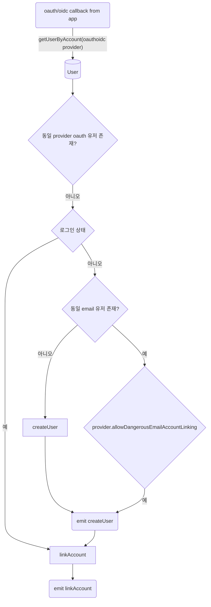

# next-atuh

- 인증 처리를 위함 [[auth.js]] 로 마이그레이션을 발표한지 시간이 좀 지났다 2023-12-09 현재 1년 이상 정도

## model
+ db model 참고 https://authjs.dev/reference/core/adapters
+ user 1:n account(oauth provider)
+ user 1:n session(oauth provider)
+ user 1:n verification_token(oauth provider)

## try next-auth@beta
+ [[diary:2023-12-09]]
- 문서가 auth.js, next.js + pages, next.js + app router, next-auth, next-auth@beta(5), auth.js 가 섞여있어서 파악이 어렵다
- 현 시점 기준으로 `next-auth@beta` 패키지를 사용해본다
- app router 에 컨벤션에 맞추기 위해서는 auth.js upgrade guide (v5) 를 참조
  + https://authjs.dev/guides/upgrade-to-v5
- adapter는 `@auth/*-adapter` 로 이관이 완료되어 이 패키지를 쓰면된다
- session-strategies 는 jwt / database 가 존재
  + https://authjs.dev/concepts/session-strategies
  - useSession 시에 db 갔다오냐(database) 마냐(jwt) 차이로 이해
  - database adapter가 제공된다면 jwt 와 관계없이 데이터는 저장됨
  - database adapter가 제공된다면 기본 session strategy 는 default 로 `database` 가 지정됨

### auth()
- server 에서 사용되며 `session` callback 은 무시되고 `jwt` callback 결과  혹은 `database` strategy 인 경우 `User` 모델이 리턴되는 것으로 이해
- server: `auth()`, client: `useSession()` 으로 이해

## 분석
- url 에 붙은 마지막 pathname 이 `action` 명이 된다
- 8 action
  + https://github.com/nextauthjs/next-auth/blob/0126f94788a263bd8420ceac9a11ed6d2c2fb958/packages/core/src/lib/utils/web.ts#L23-L30
  - providers
  - session
  - csrf
  - signin
  - signout
  - callback
  - verify-request
  - error

### client 에서 `signIn()` 함수  호출시
- [[wip]] 전체 파악이 목적에서 벗어남
```mermaid
sequenceDiagram
  participant browser
  participant next-auth/react
  participant nextjs
  participant next-auth
  participant @auth/core

  browser -->> next-auth/react: signIn()
  next-auth/react -->> next-auth/react: providers 설정 확인
  next-auth/react ->> nextjs: GET /csrf
  

  nextjs ->> next-auth/react: csrf
  next-auth/react ->> nextjs: POST /{callback,signin}/[PROVIDER]?csrfToken,callbackUrl,@
  note over next-auth/react, nextjs: credential type 인경우 callback 사용

  nextjs -->> next-auth: handler
  next-auth -->> @auth/core: Auth
  @auth/core -->> @auth/core: toInternalRequest()
  @auth/core -->> next-auth: action,cookie,@
  alt error
    next-auth --x nextjs: render page with theme
    nextjs -x browser: render page with theme
  else ok
  par AuthInternal
    @auth/core -->>+ @auth/core: new SessionStorage
    @auth/core -->> @auth/core: init():
    note over nextjs,@auth/core: providers에 signinUrl,callbackUrl추가
    note over nextjs,@auth/core: providers에 signinUrl,callbackUrl추가
    @auth/core -->> @auth/core: normalizeEndpoint -> UR
    @auth/core -->>- @auth/core: action.signIn()
  end
    @auth/core -->> @auth/core: toResponse
    @auth/core ->> browser: redirect to `toResponse().headers.Location`
  end


  nextjs ->> next-auth/react: url
  alt option으로 reload 여부 결정가능
    note over next-auth/react, nextjs: oauth 가 아니면 리로드 필요없음
    next-auth/react -->> next-auth/react: location.href = url ?? callbackUrl
  end
  next-auth/react -->> next-auth/react: __NEXTAUTH._getStorage()
```

### signin()
- redirect_url: {provider.authorization.url,oauth4webapi.processDiscoveryResponse(provider.provider.issuer)}/signin
  - cookie: pkce, state 등
  - 이렇게되면 해당 provider 에서 로그인후 다시 redirect 됨, target은 스펙에서 찾아야함(callback 으로 예상)

### callback()
```js
const user = adapter.getUserByAccount(providerAccountId, provider)
callbacks.signIn(user, account, profile)
// https://github.com/nextauthjs/next-auth/blob/0126f94788a263bd8420ceac9a11ed6d2c2fb958/packages/core/src/lib/actions/callback/handle-login.ts#L26
// jwt strategy 가정
{
  const {
    createUser,
    updateUser,
    getUser,
    getUserByAccount,
    getUserByEmail,
    linkAccount,
    createSession,
    getSessionAndUser,
    deleteSession,
  } = adapter
  
  // 로그인 여부(활성 세션)
  const user = session
    ? getUser(session.sub)
    : undefined

  if (account.type === 'email') {
    // email 로그인 유저
    const userByEmail = getUserByEmail(profile.email) // User.email
    if (userByEmail) {
      updateUser(emailVerified)
      emit event(updateUser)
    } else {
      createUser(emailVerified)
      emit event(createUser)
    }
    return user, isNewUser
  } else {
    // oauth 로그인 유저
    const userByAccount = getUserByAccount(current_provider)
    if (userByAccount) {
      // oauth account 존재
      if (user) {
        if (userByAccount.id === user.id) {
          // 활성 세션 있음과 같은 acount 로 로그인
          return user, isNewUser = false
        }
        // 활성 세션있으나 새로운 provider 로그인 시도
        throw Error(not linked)
      } else {
        return userByAccount, isNewUser = false
      }
    } else {
      if (user) {
        로그인되어 있으나 oauth로는 처음 로그인을 시도
        linkAccount()
        emit event(linkAccount)
          
        return user, isNewUser = false
      } else {
        const userByEmail = getUserByEmail(profile.email) // User.email
        if (userByEmail) {
          // 다른 oauth 를 통해 가입된 경우 옵션에 따라 처리를 달리한다
          if (allowDangerousEmailAccountLinking) {
            emit event(createUser) // 이벤트만
            // 기존 oauth 와 관계없이 account 를 생성한다
            linkAcocunt()
            emit event(linkAccount)
          } else {
            throw Error(기 존재하는 accont 가 존재)
          }
        } else {
          // oauth 를 통한 신규 가입유저
          createUser()
          emit event(createUser)
          linkAcocunt()
          emit event(linkAccount)
        }
      }
    }
  }
}
```
- 이후 프로세스에 따라 jwt 생성
  + https://github.com/nextauthjs/next-auth/blob/0126f94788a263bd8420ceac9a11ed6d2c2fb958/packages/core/src/lib/actions/callback/index.ts#L120-L153
  - [ ] TODO: callbacks.jwt 결과 -> jwt.encode with salt -> session store 를 통해 chunk화 -> cookie
  - events.signIn()

#### signin callback diagram
+ [[react-native]]
- 앱에서 oauth 로그인 연동을 가정
- [ ] TODO: 디바이스(app 또는 web)에서 로그인된 경우(session) + 같은 혹은  다른 디바이스에서 oauth 로그인 시도 고민


### 참고
+ http://swcho.github.io/blogs/2023-03-03-auth.js
  + https://authjs.dev/getting-started/providers/oauth-tutorial

## link
- [[nextjs]]
- [[smtp]]
