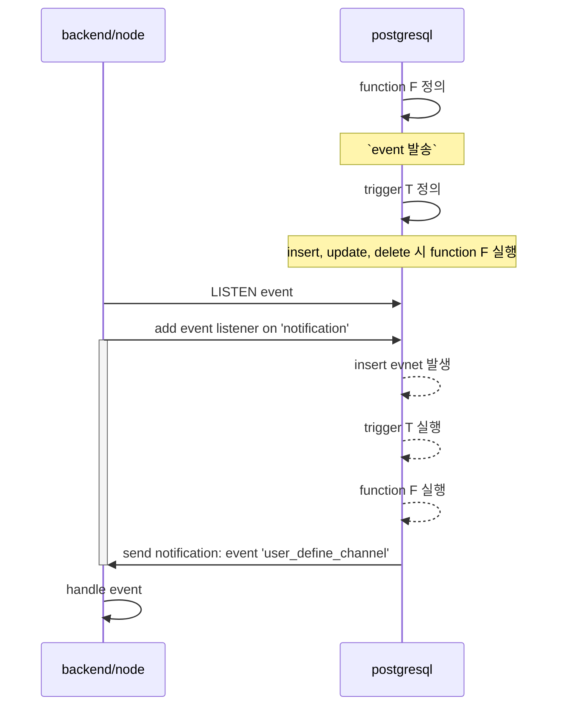

# postgresql

- create role
  user 와 함께 권한 생성
  + https://www.postgresql.org/docs/current/sql-createrole.html
## helm chart
+ https://github.com/bitnami/charts/tree/main/bitnami/postgresql/
- create database owner [ ROLE NAME ]

## 함수
- to_char - timestamp -> char
- date_trunc - timestamp 값을 유지하되 추출하는 방식으로 하여 원하는 값만 추출(시간단위 절삭등)


## trigger & event
function 을 정의한다 정의한다 정의에 사용할 수 있는 언어는 아래와 같다
- c 
- pl/plsql
- pl/python
node 에서 사용을 해야하는데 해당 언어를 지원하지 않으니 pl/plsql 을 통해서 event 를 발생키고 이를 listen 하는 방식의 구현이 가능하다


## error
- permission denied for database 
  + https://bobcares.com/blog/permission-denied-for-database-postgres/
- duplicate key value violates unique constraint 
  - ON CONFLICT (id) DO NOTHING
  - ON CONFLICT (id) SET UPDATE ...
### helm
#### upgrade 2023-04-18 
- 헬름 차트를 upgrade 했을때 에러가 출력되지 않았고 DEPLOYED 된 것으로 로그가 출력되어 그런가보다 했다. `values.yaml` 또한 적용되지 않았다.
```sh
$ helm history postgresql

REVISION        UPDATED                         STATUS          CHART                   APP VERSION     DESCRIPTION
3               Tue Apr 18 05:41:30 2023        superseded      postgresql-12.1.9       15.1.0          Upgrade complete
4               Tue Apr 18 05:51:28 2023        superseded      postgresql-12.1.9       15.1.0          Upgrade complete
5               Tue Apr 18 11:14:45 2023        superseded      postgresql-12.1.9       15.1.0          Upgrade complete
6               Tue Apr 18 12:11:03 2023        superseded      postgresql-12.1.9       15.1.0          Upgrade complete
7               Tue Apr 18 12:13:16 2023        superseded      postgresql-12.1.9       15.1.0          Upgrade complete
8               Tue Apr 18 12:14:51 2023        superseded      postgresql-12.1.9       15.1.0          Upgrade complete
9               Tue Apr 18 12:15:18 2023        superseded      postgresql-12.1.9       15.1.0          Upgrade complete
10              Tue Apr 18 12:15:25 2023        superseded      postgresql-12.1.9       15.1.0          Upgrade complete
11              Tue Apr 18 12:15:33 2023        superseded      postgresql-12.1.9       15.1.0          Upgrade complete
12              Tue Apr 18 12:28:38 2023        deployed        postgresql-12.1.9       15.1.0          Upgrade complete
```
  - 히스토리도 잘 출력되는 것을 확인할 수 있었으나 실제로는 적용이 되지 않았다
  - **중요** debugging 을 위해 `--debug --dry-run` 을 옵션을 추가하니 에러를 확인할 수 있었다.
  - '--set global.postgresql.auth.postgresPassword=$POSTGRES_PASSWORD' 를 추가하고 ENV 변수를 쉘 시작부분에 넣어서 주입하였으나 실패했다.
```sh
$ POSTGRES_PASSWORD=$(kubectl get secret --namespace "postgresql" postgresql -o jsonpath="{.data.postgres-password}" | base64 -d) helm upgrade -i postgresql chart/postgresql -n postgresql --debug --set global.postgresql.auth.postgresPassword=$POSTGRES_PASSWORD --dry-run

history.go:56: [debug] getting history for release postgresql
upgrade.go:142: [debug] preparing upgrade for postgresql
Error: UPGRADE FAILED: execution error at (postgresql/templates/secrets.yaml:17:24):
PASSWORDS ERROR: You must provide your current passwords when upgrading the release.
                 Note that even after reinstallation, old credentials may be needed as they may be kept in persistent volume claims.
                 Further information can be obtained at https://docs.bitnami.com/general/how-to/troubleshoot-helm-chart-issues/#credential-errors-while-upgrading-chart-releases

    'global.postgresql.auth.postgresPassword' must not be empty, please add '--set global.postgresql.auth.postgresPassword=$POSTGRES_PASSWORD' to the command. To get the current value:

        export POSTGRES_PASSWORD=$(kubectl get secret --namespace "postgresql" postgresql -o jsonpath="{.data.postgres-password}" | base64 -d)

helm.go:84: [debug] execution error at (postgresql/templates/secrets.yaml:17:24):
PASSWORDS ERROR: You must provide your current passwords when upgrading the release.
                 Note that even after reinstallation, old credentials may be needed as they may be kept in persistent volume claims.
                 Further information can be obtained at https://docs.bitnami.com/general/how-to/troubleshoot-helm-chart-issues/#credential-errors-while-upgrading-chart-releases

    'global.postgresql.auth.postgresPassword' must not be empty, please add '--set global.postgresql.auth.postgresPassword=$POSTGRES_PASSWORD' to the command. To get the current value:

        export POSTGRES_PASSWORD=$(kubectl get secret --namespace "postgresql" postgresql -o jsonpath="{.data.postgres-password}" | base64 -d)

UPGRADE FAILED
main.newUpgradeCmd.func2
        helm.sh/helm/v3/cmd/helm/upgrade.go:202
github.com/spf13/cobra.(*Command).execute
        github.com/spf13/cobra@v1.6.1/command.go:916
github.com/spf13/cobra.(*Command).ExecuteC
        github.com/spf13/cobra@v1.6.1/command.go:1044
github.com/spf13/cobra.(*Command).Execute
        github.com/spf13/cobra@v1.6.1/command.go:968
main.main
        helm.sh/helm/v3/cmd/helm/helm.go:83
runtime.main
        runtime/proc.go:250
runtime.goexit
        runtime/asm_arm64.s:1172
```
  - 분리된 라인으로 `export POSTGRES_PASSWORD=$(...)` 를 shell 자체에 주입을 하고 나서야 명령어가 성공하는 것을 확인할 수 있다.
```sh
$ export POSTGRES_PASSWORD=$(kubectl get secret --namespace "postgresql" postgresql -o jsonpath="{.data.postgres-password}" | base64 -d)
$ helm upgrade -i postgresql chart/postgresql -n postgresql --debug --set global.postgresql.auth.postgresPassword=$POSTGRES_PASSWORD --dry-run

history.go:56: [debug] getting history for release postgresql
upgrade.go:142: [debug] preparing upgrade for postgresql
upgrade.go:150: [debug] performing update for postgresql
upgrade.go:313: [debug] dry run for postgresql
Release "postgresql" has been upgraded. Happy Helming!
NAME: postgresql
LAST DEPLOYED: Tue Apr 18 12:27:39 2023
```
  - 그리고 포트포워딩(localhost 를 위해)도 확인하자
### lock
```shell
SELECT pid, *
FROM pg_locks l
         JOIN pg_class t ON l.relation = t.oid AND t.relkind = 'r'
where relname ='[TABLE_NAME]'
```
pid 확인해서 컨테이너 접속후
```shell
kill [PID]
```

### ON CONFLICT DO UPDATE command cannot affect row a second time
```sh 
[2024-01-28 19:54:38] [21000] ERROR: ON CONFLICT DO UPDATE command cannot affect row a second time
[2024-01-28 19:54:38] Hint: Ensure that no rows proposed for insertion within the same command have duplicate constrained values.
```
- conflict 키 중복, 한 쿼리에 여러 아이템에대한 컨플릭트처리를 하는데 키 중복이 있었다.

### WARNING:  database "DATABASE_NAME" has a collation version mismatch
- 마이너 버전 업그레이드 후 발생
- 에러는 아니지만 계속 찍힘 로그가
  ```sh
  2025-07-19 17:10:17.550 GMT [1121637] WARNING:  database "DATABASE_NAME" has a collation version mismatch
  2025-07-19 17:10:17.550 GMT [1121637] DETAIL:  The database was created using collation version 2.31, but the operating system provides version 2.36.
  2025-07-19 17:10:17.550 GMT [1121637] HINT:  Rebuild all objects in this database that use the default collation and run ALTER DATABASE DATABASE_NAME REFRESH COLLATION VERSION, or build PostgreSQL with the right library version.
  ```
- 해결, 에러가 나는 데이터베이스 별로 모두 진행
  ```sql 
  ALTER DATABASE DATABASE_NAME REFRESH COLLATION VERSION;
  REINDEX DATABASE DATABASE_NAME;
  ```

## checkpoint
- checkpoint 이슈를 잡다가 로그에서 말한데로 디렉토리 만들던 중 디비 crash
  ```sh
  ~$ cd /var/openebs/
  local/  ndm/    pv/     pv2/    sparse/
  ~$ cd /var/openebs/local/
  /var/openebs/local$ cd pvc-xx
  /var/openebs/local/pvc-xx$ ls
  data
  /var/openebs/local/pvc-xx$ cd data/
  -bash: cd: data/: Permission denied
  /var/openebs/local/pvc-xx$ ls
  data
  /var/openebs/local/pvc-xx$ sudo ls data/
  base  global  pg_ident.conf  pg_logical  pg_multixact  pg_notify  pg_subtrans  PG_VERSION  pg_wal  pg_xact  postgresql.auto.conf  postmaster.opts
  /var/openebs/local/pvc-xx$ sudo ls -alh data/pg_logical
  total 20K
  drwxrws---  4 home home 4.0K Oct 31 02:35 .
  drwx--S--- 10 home home 4.0K Oct 31 02:41 ..
  drwxr-sr-x  2 home home 4.0K Oct 31 02:35 mappings
  -rw-------  1 home home    8 Oct 31 02:35 replorigin_checkpoint
  drwxr-sr-x  2 home home 4.0K Oct 31 02:34 snapshots
  /var/openebs/local/pvc-xx$ sudo rm -r data/pg_logical/{mappings,snapshots}
  /var/openebs/local/pvc-xx$ sudo ls -alh data/pg_logical
  total 12K
  drwxrws---  2 home home 4.0K Oct 31 02:46 .
  drwx--S--- 10 home home 4.0K Oct 31 02:41 ..
  -rw-------  1 home home    8 Oct 31 02:35 replorigin_checkpoint
  /var/openebs/local/pvc-xx$ sudo stat -c '%u %g %n' data
  1001 1001 data
  /var/openebs/local/pvc-xx$ sudo stat -c '%u %g %n' data/pg_logical
  1001 1001 data/pg_logical
  /var/openebs/local/pvc-xx$ sudo ls -alh data/
  total 212K
  drwx--S--- 10 home home 4.0K Oct 31 02:51 .
  drwxrwsrwx  3 root home 4.0K Jan 15  2023 ..
  drwxrws--- 14 home home 4.0K Oct 31 02:27 base
  drwxrws---  2 home home 4.0K Oct 31 02:35 global
  -rw-rw----  1 home home 1.6K Jan 15  2023 pg_ident.conf
  drwxrws---  2 home home 4.0K Oct 31 02:46 pg_logical
  drwxrws---  4 home home 4.0K Jan 15  2023 pg_multixact
  drwxrws---  2 home home 4.0K Oct 31 02:35 pg_notify
  drwxrws---  2 home home 4.0K Oct 31 01:37 pg_subtrans
  -rw-rw----  1 home home    3 Jan 15  2023 PG_VERSION
  drwxrws---  3 home home 156K Oct 31 02:35 pg_wal
  drwxrws---  2 home home 4.0K Oct 26 07:59 pg_xact
  -rw-rw----  1 home home   88 Jan 15  2023 postgresql.auto.conf
  -rw-rw----  1 home home  249 Oct 31 02:51 postmaster.opts
  /var/openebs/local/pvc-xx$ sudo mkdir -p data/pg_logical/snapshots
  sudo mkdir -p data/pg_logical/mappings
  sudo mkdir -p data/pg_commit_ts
  sudo mkdir -p data/pg_tblspc
  sudo mkdir -p data/pg_replslot

  sudo chown -R 1001:1001 data/pg_logical data/pg_commit_ts data/pg_tblspc data/pg_replslot
  /var/openebs/local/pvc-xx$ sudo chmod 700 data/pg_commit_ts data/pg_tblspc data/pg_replslot
  /var/openebs/local/pvc-xx$ sudo mkdir -p data/pg_twophase
  sudo chown 1001:1001 data/pg_twophase
  sudo chmod 700 data/pg_twophase
  /var/openebs/local/pvc-xx$ sudo mkdir -p data/pg_snapshots
  sudo chown 1001:1001 data/pg_snapshots
  sudo chmod 700 data/pg_snapshots
  /var/openebs/local/pvc-xx$ sudo mkdir -p data/pg_stat_tmp
  sudo chown 1001:1001 data/pg_stat_tmp
  sudo chmod 700 data/pg_stat_tmp
  /var/openebs/local/pvc-xx$
  ```

## link
- [[kubernetes]]
- [[psql]]
- [[helm]]
- [[sql]]
- [[pgdump]]
- [[pgdumpall]]
