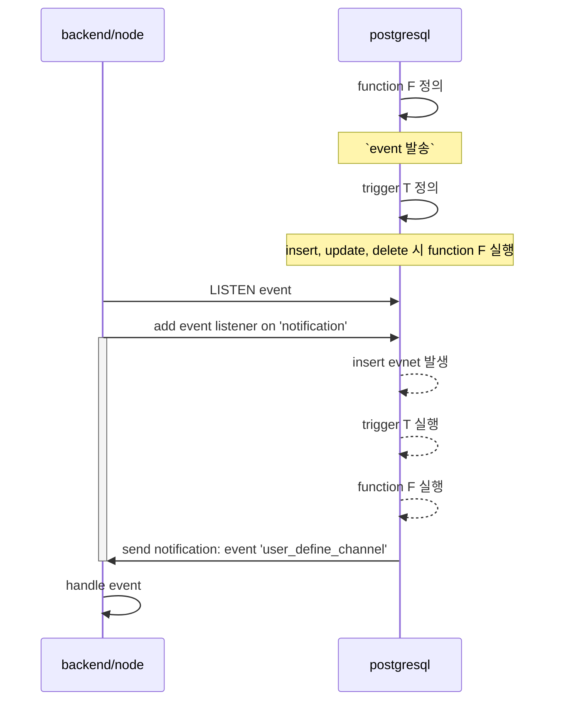

# postgresql

- create role
  user 와 함께 권한 생성
  + https://www.postgresql.org/docs/current/sql-createrole.html
## helm chart
+ https://github.com/bitnami/charts/tree/main/bitnami/postgresql/

## trigger & event
function 을 정의한다 정의한다 정의에 사용할 수 있는 언어는 아래와 같다
- c 
- pl/plsql
- pl/python
node 에서 사용을 해야하는데 해당 언어를 지원하지 않으니 pl/plsql 을 통해서 event 를 발생키고 이를 listen 하는 방식의 구현이 가능하다

## error
- permission denied for database 
  + https://bobcares.com/blog/permission-denied-for-database-postgres/
- duplicate key value violates unique constraint 
  - ON CONFLICT (id) DO NOTHING
  - ON CONFLICT (id) SET UPDATE ...

## related
- [[kubernetes]]
- [[psql]]
