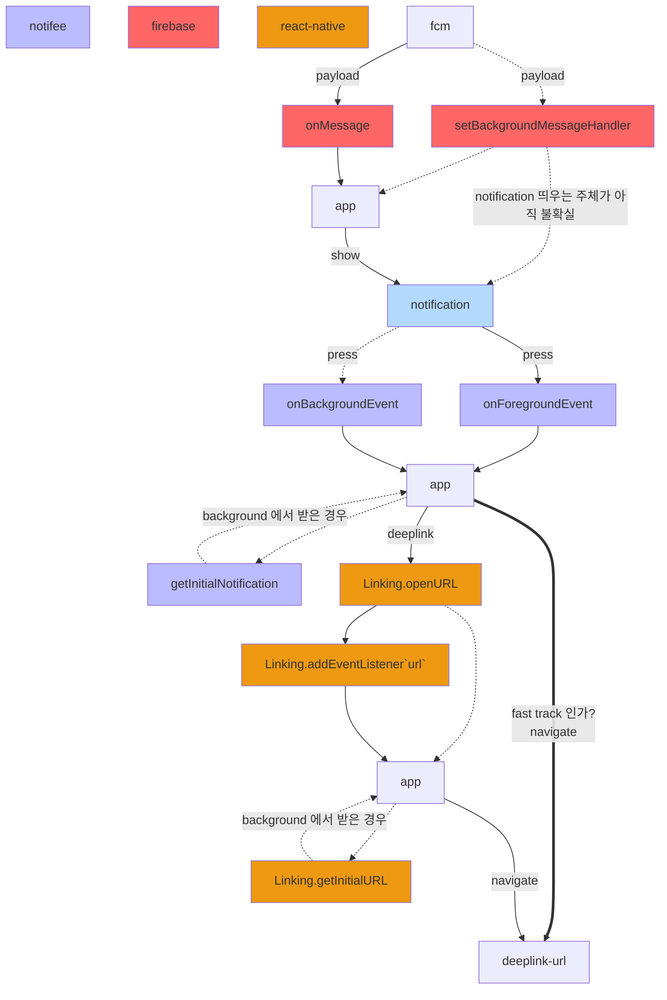
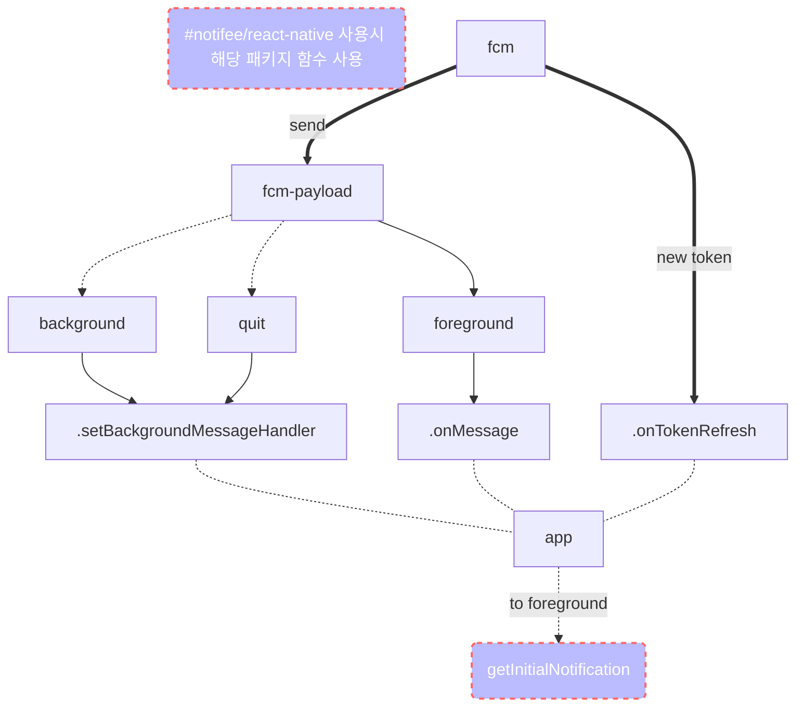
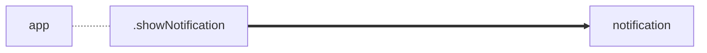
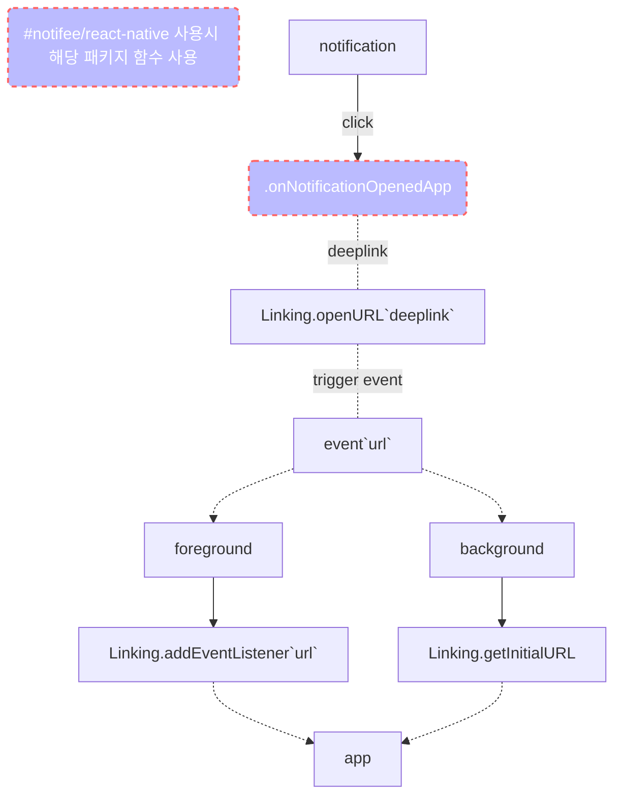

# push-notification
- app: active
  - 수신: onMessage
- app: active 가 아닌경우
  - 수신: setBackgroundMessageHandler
  - ~~getInitialNotification~~ `@notifee/react-native` 사용시 `notifee.getInitialNotification`
- remote notification 이 눌린경우
  - 수신: ~~onNotificationOpenedApp~~ `@notifee/react-native` 사용시 `notifee.onForegroundEvent` - `type: 'PRESS'`
- 서버에서 토큰이 변경된 경우
  - 수신: onTokenRefresh

## [[fcm]] - push-notification 흐름도
### 딥링크 처리까지의 큰 흐름

- 흐름도를 보면 Linking.openURL 을 타지 않고 바로 네비게이션 처리가 가능하다
- `Linking` 을 사용하는 이유
  - `notification` 을 통하지 않고 다른 앱이나 웹에서 [[deeplink]] 를 받기 위해서라도 필요할 것으로 생각된다
- 헷갈릴까봐 그래프에 표시 하지 않았지만 `@react-native-firebase/messaging` 에서 제공하는 이벤트 핸들러는 `@notifee/react-native` 의 on{Fore/Back}groundEvent 에도 동일하게 전달되는 것을로 보인다.  `DELIVERED` 타입 좀 더 확인을 용의가 있다면 firebase 이벤트 핸들러를 제거할 수 있을 수 있다
### fcm 메시지 수신

### 노티피케이션을 보여주는 과정

### 노티피케이션 데이터에 따른 핸들링(e.g. deeplink)

## link
- [[fcm]]
