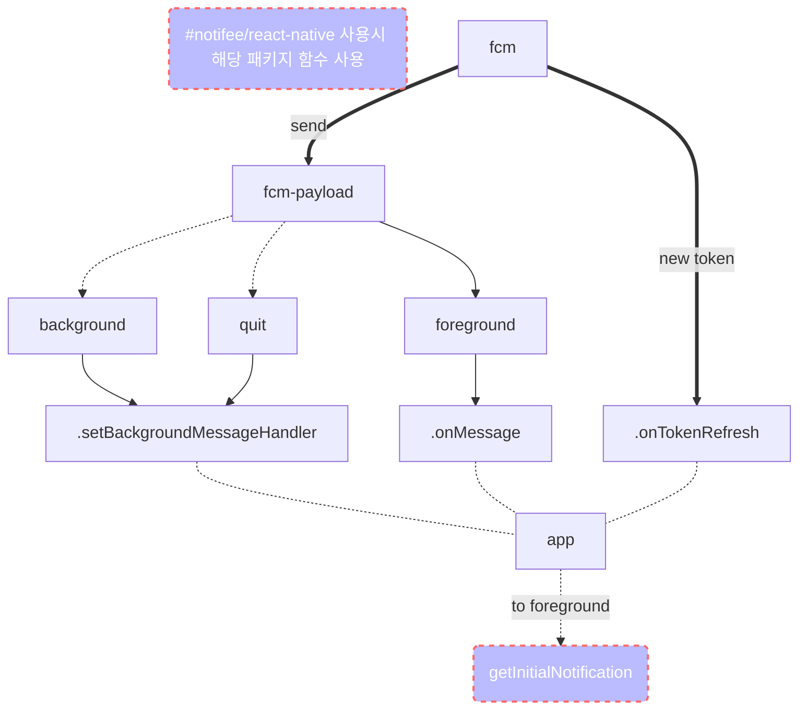
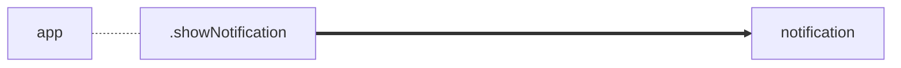
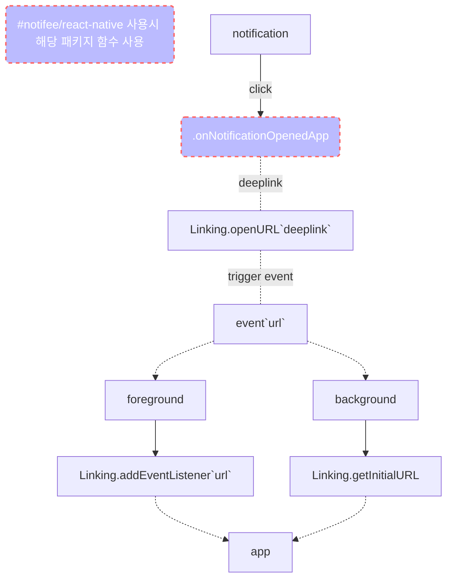

# push-notification
- app: active
  - 수신: onMessage
- app: active 가 아닌경우
  - 수신: setBackgroundMessageHandler
  - ~~getInitialNotification~~ `@notifee/react-native` 사용시 `notifee.getInitialNotification`
- remote notification 이 눌린경우
  - 수신: ~~onNotificationOpenedApp~~ `@notifee/react-native` 사용시 `notifee.onForegroundEvent` - `type: 'PRESS'`
- 서버에서 토큰이 변경된 경우
  - 수신: onTokenRefresh

## [[fcm]] - push-notification 흐름도
### fcm 메시지 수신

### 노티피케이션을 보여주는 과정

### 노티피케이션 데이터에 따른 핸들링(e.g. deeplink)

## link
- [[fcm]]
