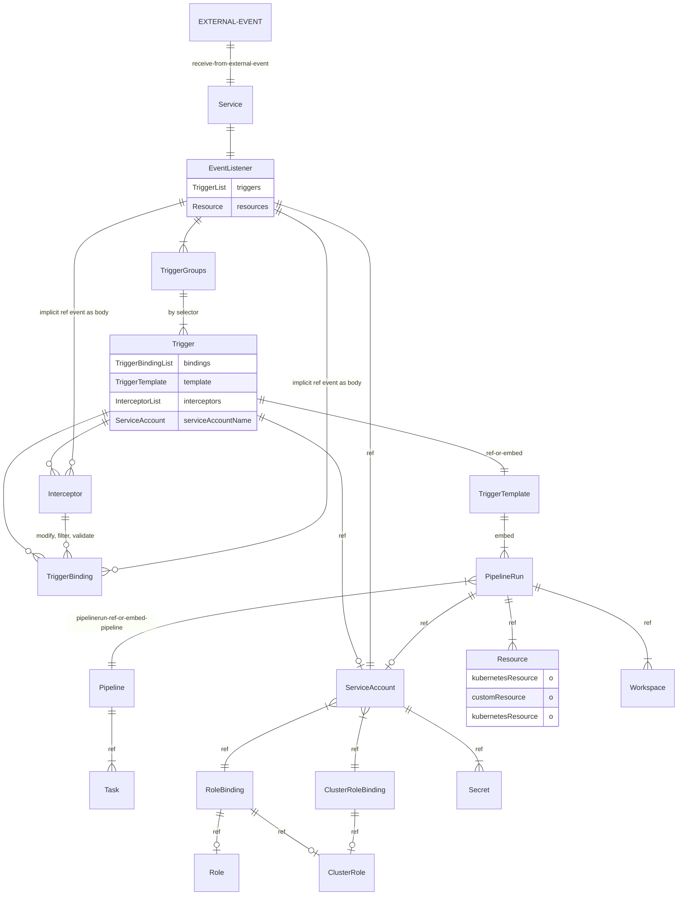
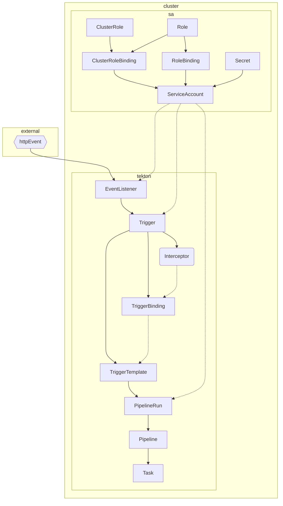

# tekton

[[kubernetes]] 베이스의 ci/cd
- [ ] TODO: 모듈화가 잘 되어 있지만 해당 파이브라인 관리 코드를 프로젝트에 놓아야할지 인프라쪽에 놓아야할지 고민 필요

---
## 구조
### 흐름도


- 대체가능
  - TriggerBinding <-> ClusterTriggerBinding
  - TriggerTemplate <-> ClusterTriggerTemplate
  - TriggerTemplate 은 PipelineRun 외에 다른 오브젝트 참조가 가능
    - PipelineRun
    - Pipeline
    - TaskRun
    - Task
    - CustumTask
- [ ] TriggerBinding <-> TriggerTemplate
  - [ ] n..1 관계로 Trigger 에서 만나는데 TriggerBinding 수 많은 TriggerTemplate 을 호출되는지 확인이 필요

### 흐름도 단순화 버전
> 2023-01-29 에 타 프로젝트에서 비슷한 걸 그린 단순화 버전이 있어서 이쪽으로 이동

+ https://github.com/deptno/wiki/blob/723c94917898fc9bf99e4475196dc2a67fa60de4/project.md#tekton
#### tekton

- 생성 오브젝트
  - external
  - clsuter
    - EventListeer
    - EventListeer
    - EventListeer
    - EventListeer
---

### CRD
EventListener > TriggerBinding > TriggerTemplate > PipelineRun > Pipeline > Task

- EventListener
- TriggerBinding 
- TriggerTemplate 
- PipelineRun 
- Pipeline 
- Task

### Trigger
+ https://tekton.dev/docs/getting-started/triggers/
- EventListener
  - PipelineBinding 
  - PipelineTemplate 
    - Pipeline 
- RoleBinding
  - ServiceAccount
  - ClusterRole
- ClusterRoleBinding
  - ServiceAccount
  - ClusterRole

| CRD              | 설명                     |
|------------------|--------------------------|
| Event            | 트리거                   |
| PipelineBinding  | 파이프라인에 변수 바인딩 |
| PipelineTemplate |                          |
| PipelineRun      | 파이프라인의 실행        |
| Pipeline         | Task 콜렉션              |
| Task             |                          |


## install
- [X] pipelines
- [X] triggers
- [ ] results 실행 결과?

---
- [[diary:2023-01-19]] 
- tutorial
  + https://tekton.dev/docs/how-to-guides/clone-repository/
    - `tkn hub install task git-clone` 에러가 나므로 `kubectl apply -f` 를 통한 직접 설치가 필요 2023-01-20 
    
## pipeline
+ https://tekton.dev/docs/pipelines/install/#installing-tekton-pipelines-on-kubernetes
```sh
kubectl apply --filename https://storage.googleapis.com/tekton-releases/pipeline/latest/release.yaml
```
`tecton-pipelines` namepsace 로 설치됨

- pvc 설정
```sh
apiVersion: v1
kind: ConfigMap
metadata:
  labels:
    app.kubernetes.io/instance: default
    app.kubernetes.io/part-of: tekton-pipelines
  name: config-artifact-pvc
  namespace: tekton-pipelines
data:
  storageClassName: "openebs-hostpath"
  size: "10GiB"
```

- private repo 설정
+ https://tekton.dev/docs/installation/pipelines/#configuring-cloudevents-notifications

- pipeline 설정 `cm/feature-flags` 에 있다
  - [ ] require-git-ssh-secret-known-hosts
  - disable-creds-init credential initialization 을 스킵하고 secret 로드로 대체

## dashboard
```sh 
kubectl apply --filename \
https://storage.googleapis.com/tekton-releases/dashboard/latest/tekton-dashboard-release.yaml
```

## cli
+ https://github.com/tektoncd/cli
```sh
brew install tektoncd-cli
```

## github 
[[ssh-keygen]] 후 github 에 [[ssh]] 등록

1. `Secret` 생성
```sh 
ssh-keygen -t ed25519 -C "[deptno@service.domain]"
# save current directory
kubectl create secret generic [secret_name] --from-file=ssh-privatekey=./id_ed25519.tekton.dev --type=kubernetes.io/ssh-auth
kubectl annotate secret [secret_name] tekton.dev/git-0=github.com
```
2. `ServiceAccount` 생성
```sh 
apiVersion: v1
kind: ServiceAccount
metadata:
  name: tekton-deptno
secrets:
  - name: [secret_name]
```
3. `PipelineRun` 에 주입하여 사용

tekton hub 에 있는 `git-clone` task 로 확인 DONE: 2023-01-24

## 구현
### trigger 를 통한 github private 레포지터리 클론 파이프라인 실행
`ssh-github` 아래와 같은 형태
```sh
Name:         ssh-github-deptno
Namespace:    project-things
Labels:       <none>
Annotations:  tekton.dev/git-0: github.com

Type:  kubernetes.io/ssh-auth

Data
====
ssh-privatekey:  411 bytes
```

`git-clone` task 는 hub에서 설치했다
  + https://hub.tekton.dev/tekton/task/git-clone

```sh 
apiVersion: v1 
kind: ServiceAccount
metadata:
  name: tt-sa
secrets:
  - name: ssh-github # `sh-privatekey` 를 데이터로 갖는다
---
apiVersion: rbac.authorization.k8s.io/v1 
kind: RoleBinding
metadata:
  name: tt-rb
  namespace: project-things
subjects:
- kind: ServiceAccount
  name: tt-sa
roleRef:
  apiGroup: rbac.authorization.k8s.io
  kind: ClusterRole
  name: tekton-triggers-eventlistener-roles
---
apiVersion: rbac.authorization.k8s.io/v1
kind: ClusterRoleBinding
metadata:
  name: tt-crb
subjects:
- kind: ServiceAccount
  name: tt-sa
  namespace: project-things
roleRef:
  apiGroup: rbac.authorization.k8s.io
  kind: ClusterRole
  name: tekton-triggers-eventlistener-clusterroles
---
apiVersion: triggers.tekton.dev/v1beta1
kind: EventListener
metadata:
  name: tt-ev
spec:
  serviceAccountName: tt-sa
  triggers:
  - triggerRef: tt-tr
  resources:
    kubernetesResource:
      serviceType: ClusterIP
      servicePort: 80
---
apiVersion: triggers.tekton.dev/v1beta1
kind: Trigger
metadata:
  name: tt-tr
spec:
  bindings:
  - ref: tt-tb
  template:
    ref: tt-tt
---
apiVersion: triggers.tekton.dev/v1beta1
kind: TriggerBinding
metadata:
  name: tt-tb
spec:
  params:
  - name: url
    value: $(body.url)
---
apiVersion: triggers.tekton.dev/v1beta1
kind: TriggerTemplate
metadata:
  name: tt-tt
spec:
  params:
  - name: url
  resourceTemplates:
  - apiVersion: tekton.dev/v1beta1
    kind: PipelineRun
    metadata:
      generateName: tt-tt-pr
    spec:
      serviceAccountName: tt-sa
      pipelineRef:
        name: tt-pl
      params:
      - name: repo-url
        value: $(tt.params.url)
      workspaces:
      - name: shared-data
        emptyDir: {}
---
apiVersion: tekton.dev/v1beta1
kind: Pipeline
metadata:
  name: tt-pl
  namespace: project-things
spec:
  description: clone git repository
  params:
  - name: repo-url
    type: string
    description: https://github.com/[username]/[reponame].git
  workspaces:
  - name: shared-data
    description: working directory
  tasks:
  - name: fetch-source
    taskRef:
      name: git-clone
    params:
    - name: url
      value: $(params.repo-url)
    workspaces:
    - name: output
      workspace: shared-data
```

- 실행
```sh 
$ curl -X POST \                                                                                                                                               ok  4s  16.15.0 node  1.59.0 rust  01:12:56
  http://localhost:8080 \
  -H 'Content-Type: application/json' \
  -d '{ "url": "git@github.com:deptno/private-repo.git" }'
{"eventListener":"tt-ev","namespace":"project-things","eventListenerUID":"54001b1f-1859-48a3-802b-d220a954f23c","eventID":"19375452-32d1-4650-aa03-beb73f7f7538"}
$ tkn pr logs                                                                                                                                                      ok  16.15.0 node  1.59.0 rust  01:13:07
? Select pipelinerun: tt-tt-prkbpb2 started 1 second ago
Pipeline still running ...
task fetch-source has failed: "step-clone" exited with code 1 (image: "gcr.io/tekton-releases/github.com/tektoncd/pipeline/cmd/git-init@sha256:28ff94e63e4058afc3f15b4c11c08cf3b54fa91faa646a4bbac90380cd7158df"); for logs run: kubectl -n project-things logs tt-tt-prkbpb2-fetch-source-pod -c step-clone

[... logs]
```

## error
pipelinerun 을 통해서 pod 생성 후 계속 pending 상태라 보니 pvc 가 바운드되지 않는 문제
```sh
Events:
  Type     Reason            Age   From               Message
  ----     ------            ----  ----               -------
  Warning  FailedScheduling  2m8s  default-scheduler  0/1 nodes are available: pod has unbound immediate PersistentVolumeClaims. preemption: 0/1
 nodes are available: 1 No preemption victims found for incoming pod..
```
-> pvc 를 가보니 storageClassName 이 비어있다, 현 세팅은 `openebs-hostpath` 를 지정해야 사용이 가능한 상태
-> manifest 에서 pvc 설정에 storageClassName 을 설정했음에도 동작하지 않았다.
-> pvc 에서 `spec.storageClassName: openebs-hostpath` 를 주입하니 정상 실행된다.
-> `PipelineRun` 에서 `storageClassName` 을 주입하면 동작한다
```yaml
  workspaces:
  - name: shared-data
    volumeClaimTemplate:
      spec:
        accessModes:
        - ReadWriteOnce
        resources:
          requests:
            storage: 1Gi
        storageClassName: openebs-hostpath
```
+ https://tekton.dev/docs/pipelines/workspaces/#using-persistent-volumes-within-a-pipelinerun
---
```sh 
{
    "severity": "fatal",
    "timestamp": "2023-01-28T08:55:54.927Z",
    "logger": "eventlistener",
    "caller": "v2/main.go:205",
    "message": "Start returned an error",
    "error": "Timed out waiting on CaBundle to available for clusterInterceptor: Timed out waiting on CaBundle to available for Interceptor: clusterinterceptors. triggers.tekton.dev is forbidden: User \"system:serviceaccount:project-things:default\" cannot list resource \"clusterinterceptors\" in API group \"triggers.tekton.dev\" at the cluster scope"
}
```
account 에 tekton에서 제공하는 ClusterRole, Role 이 제대로 되어 있는지 확인한다
  + https://github.com/tektoncd/triggers/blob/main/examples/rbac.yaml
## releated
- [[kubernetes]]
- [[metrics-server]]
- [[ci]]
