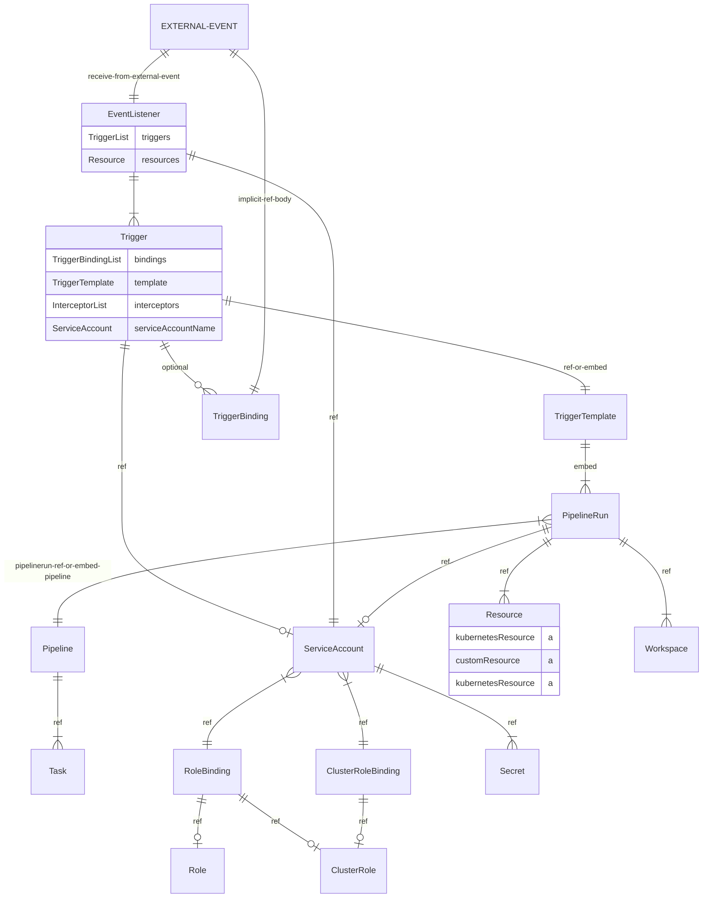

# tekton

[[kubernetes]] 베이스의 ci/cd
- [ ] TODO: 모듈화가 잘 되어 있지만 해당 파이브라인 관리 코드를 프로젝트에 놓아야할지 인프라쪽에 놓아야할지 고민 필요

---
## 구조


- 대체가능
  - TriggerBinding <-> ClusterTriggerBinding
  - TriggerTemplate <-> ClusterTriggerTemplate
  - TriggerTemplate 은 PipelineRun 외에 다른 오브젝트 참조가 가능
    - PipelineRun
    - Pipeline
    - TaskRun
    - Task
    - CustumTask
- [ ] TriggerBinding <-> TriggerTemplate
  - [ ] n..1 관계로 Trigger 에서 만나는데 TriggerBinding 수 많은 TriggerTemplate 을 호출되는지 확인이 필요

### CRD
EventListener > TriggerBinding > TriggerTemplate > PipelineRun > Pipeline > Task

- EventListener
- TriggerBinding 
- TriggerTemplate 
- PipelineRun 
- Pipeline 
- Task

### Trigger
+ https://tekton.dev/docs/getting-started/triggers/
- EventListener
  - PipelineBinding 
  - PipelineTemplate 
    - Pipeline 
- RoleBinding
  - ServiceAccount
  - ClusterRole
- ClusterRoleBinding
  - ServiceAccount
  - ClusterRole

| CRD              | 설명                     |
|------------------|--------------------------|
| Event            | 트리거                   |
| PipelineBinding  | 파이프라인에 변수 바인딩 |
| PipelineTemplate |                          |
| PipelineRun      | 파이프라인의 실행        |
| Pipeline         | Task 콜렉션              |
| Task             |                          |


## install
- [X] pipelines
- [X] triggers
- [ ] results 실행 결과?

---
- [[diary/2023-01-19]] 
- tutorial
  + https://tekton.dev/docs/how-to-guides/clone-repository/
    - `tkn hub install task git-clone` 에러가 나므로 `kubectl apply -f` 를 통한 직접 설치가 필요 2023-01-20 
    
## pipeline
+ https://tekton.dev/docs/pipelines/install/#installing-tekton-pipelines-on-kubernetes
```sh
kubectl apply --filename https://storage.googleapis.com/tekton-releases/pipeline/latest/release.yaml
```
`tecton-pipelines` namepsace 로 설치됨

- pvc 설정
```sh
apiVersion: v1
kind: ConfigMap
metadata:
  labels:
    app.kubernetes.io/instance: default
    app.kubernetes.io/part-of: tekton-pipelines
  name: config-artifact-pvc
  namespace: tekton-pipelines
data:
  storageClassName: "openebs-hostpath"
  size: "10GiB"
```

- private repo 설정
+ https://tekton.dev/docs/installation/pipelines/#configuring-cloudevents-notifications

- pipeline 설정 `cm/feature-flags` 에 있다
  - [ ] require-git-ssh-secret-known-hosts
  - disable-creds-init credential initialization 을 스킵하고 secret 로드로 대체

## dashboard
```sh 
kubectl apply --filename \
https://storage.googleapis.com/tekton-releases/dashboard/latest/tekton-dashboard-release.yaml
```

## cli
+ https://github.com/tektoncd/cli
```sh
brew install tektoncd-cli
```

## github 
[[ssh-keygen]] 후 github 에 [[ssh]] 등록

1. `Secret` 생성
```sh 
ssh-keygen -t ed25519 -C "[deptno@service.domain]"
# save current directory
kubectl create secret generic [secret_name] --from-file=ssh-privatekey=./id_ed25519.tekton.dev --type=kubernetes.io/ssh-auth
kubectl annotate secret [secret_name] tekton.dev/git-0=github.com
```
2. `ServiceAccount` 생성
```sh 
apiVersion: v1
kind: ServiceAccount
metadata:
  name: tekton-deptno
secrets:
  - name: [secret_name]
```
3. `PipelineRun` 에 주입하여 사용

tekton hub 에 있는 `git-clone` task 로 확인 DONE: 2023-01-24

## 구현
### github 연동
- support github private repository

예상 개념
1. pipeline 생성
2. task 생성 -> pod 화됨
  - tekton hub 에서 검색
  - 없으면 task 생성
    - task(pod) 는 step(container)으로 구성
3. event 정의
4. event -> pipelinerun 실행 + service account 주입
  - kubernetes 쪽에서 미리 어카운트 생성 및 권한 주입

## error
pipelinerun 을 통해서 pod 생성 후 계속 pending 상태라 보니 pvc 가 바운드되지 않는 문제
```sh
Events:
  Type     Reason            Age   From               Message
  ----     ------            ----  ----               -------
  Warning  FailedScheduling  2m8s  default-scheduler  0/1 nodes are available: pod has unbound immediate PersistentVolumeClaims. preemption: 0/1
 nodes are available: 1 No preemption victims found for incoming pod..
```
-> pvc 를 가보니 storageClassName 이 비어있다, 현 세팅은 `openebs-hostpath` 를 지정해야 사용이 가능한 상태
-> manifest 에서 pvc 설정에 storageClassName 을 설정했음에도 동작하지 않았다.
-> pvc 에서 `spec.storageClassName: openebs-hostpath` 를 주입하니 정상 실행된다.
-> `PipelineRun` 에서 `storageClassName` 을 주입하면 동작한다
```yaml
  workspaces:
  - name: shared-data
    volumeClaimTemplate:
      spec:
        accessModes:
        - ReadWriteOnce
        resources:
          requests:
            storage: 1Gi
        storageClassName: openebs-hostpath
```
+ https://tekton.dev/docs/pipelines/workspaces/#using-persistent-volumes-within-a-pipelinerun

## releated
- [[kubernetes]]
- [[metrics-server]]
