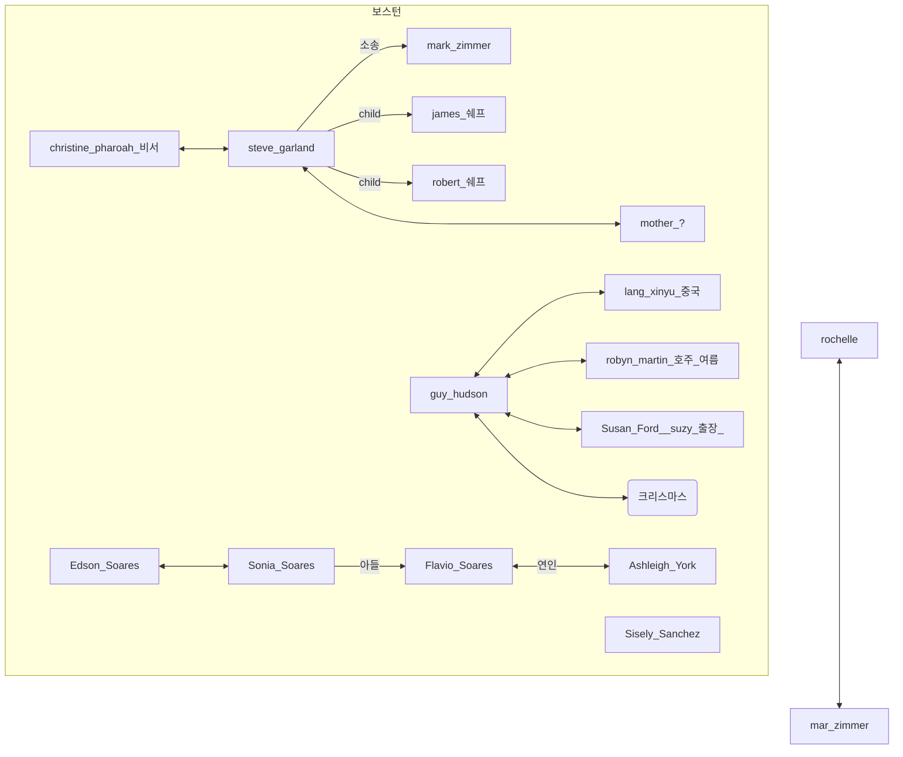
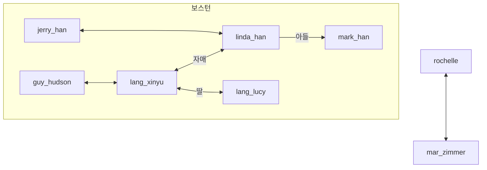

# The Roottrees are Dead

- WRTD
  - 열쇠를 가진 누군가가 사진을 가져감,

- 죽은사람
  - carl, brenda + 딸 셋
  - 사장 3/5 죽음
    - Guy
    - Ernie Madsen Jr. - carl 과 4촌, 4대 회장
    - Carl

- ChrisRaff75@prodigee.us 사이트 내리라함
- Thomas Overwood 사이트 운영자인듯

- lulu 약혼자 Chris Rafferty, 대학교 학년때 그림 1997
- 8촌의(죽은 딸명이랑 같은 레벨) 사진 3명
  - Davey kellogg 4th 수영선수
    - Bethany 졸업앨범 - 여동생, Kellogg?
  - Stephani, landon, ~~cattrall~~
- 하나는 madson <-> ernie, 하는 kellogg

- Stephani 엄마는 캐롤라인, 몰덴: 마크와 결혼, 언니가 그윈돌린, 아빠가 자크, 매형이 윌슨, 사촌이 보니

- Ron(친적임) <-> Panelope

- [X] clancy jr
- edward
- elias c
- [ ] jack - 마지막세대
- wolf

- samantha
- tessa
- november
- kirstina
- candy
-

- hudson + patrisia
- elias jr 도 + patsy
- morden gwyndoline + DR. wilson
- debbie + ernie(jr), 딸 nicole

## 2
- elias - beth
- beth - elizabeth

## 튜토리얼 분석
- 주인공의 능력 증명을 위해 주어지는 첫번째 퀘스트
- 처음 주어지는 단서
  - 3명이 나와있는 사진, 사진의 제목 그리고 설명
  - 전체 사람 목록
- 풀어가는 과정
  - 사진으로 부터 3명 얼굴 pick
  - 인터넷에서 `roottree` 검색
    - 검색결과에 대한 요약, 감상을 결과로 유저에게 보여줌
      - 검색 결과 최근 일어난 비행기 사고가 많이나옴
      - 그외에 셀수없이 많은 광고와 제품에 대한 기사들이 나옴, 이것들은 `roottree candy company` 에서 만들어진 것
      - 그리고 많은 문서들이 `carl roottree` 에 대해서 언급하고 있다는 것을 알림
      - `carl roottree` 의 딸들  어렸을때부터 유명했었던 `roottree sisters` 를 추도한다
  - `roottree sisters` 검색
    - `roottree sisters` 의 모델 커리어에 대한 내용들과 그들을 위한 10대들의 팬사이트가 검색결과에 있음을 알림
    - 팬사이트의 내용이 그대로 인용됨
      - [ ] `Rhyana` 가 가장 나이많음 써있음, 가장 인기많고 `TMS` 와 결혼했다라는 내용이 언급
      - [ ] `Rhiley` 가 가장 스마트함
      - [ ] `Rhose` 가 중간 나이
      - 엄마 `Brenda` 가 패션 디자이너이며 `roottree sisters` 는 그 브랜드였던 `ROOT` 의 모델로 활동했음을 언급
      - `MarpleCrips`가 팬사이트 주인이 가장 좋아하는 `roottree candy` 맛임이 써있음
      - 그리고 주인장은 체크무니 옷을 입은 왜나면 좋아하는 `Rhiley`가 거의 모든 광고 사진에서 입고있기 때문
      - 그리고 언젠간 귀에 피어싱을 할거라고 밝힘 `Rhose` 처럼
      - 그리고 쓸때 없는 내용도 있었음을 언급
        - ROOT 브랜드 내에서 자매들이 좋아한 패션 라인등에 대한 언급
  - [X] 여기서 확인되는 것
    - [X] 3명이의 직업 모델
    - [X] 체크무니옷과 귀걸이 나머지는 소거법으로(남는한명) 의 얼굴이 결정됨
    - [X] 세명의 이름이 결정됨(나이순 제약에 따라 순서가 정해지기때문)
  - 남은 문제는 `Rhose` 라는 이름이 처음 주어진 목록에 없음
  - `rhose roottree` 검색
    - 언니만큼 유명하진 않다는 언급만 있고 다른 결과가 없음이 표시됨
  - `carl roottree` 검색
    - 회사에서는 한시간내에 부고기사를 준비하고 있었음이 쓰여있음
    - 캔디회사의 대표
    - 아내인 `brenda`와 `ROOT.` 브랜드를 co-found 함이써있음, `ROOT.` 브랜드 명이 명시됨 ROOT -> ROOT. 임을 인지할 수 있음
  - `ROOT` 검색
    - `ROOT` 는 너무 흔한 워드라고 나옴
  - `ROOT.` 검색
    - 옷 회사에 대한 내용이 쓰여있음
    - 트래픽 때문에 사이트가 다운되어있지만 여러 사이트에서 해당 옷에 대해서 멘션하고 있음등이 언급
    - 일년에 두번 메거진을 발간한다는 내용이 존재
      - 이중에 웹마스터가 아끼는건 1985년 발간된 것이며 여기에 `brenda` 가 그의 딸 `rhose` 와 함께 찍은 사진이있음
      - 여기서 최초로 `rhose` 의 본명이 `carly` 임이 언급됨
  - [X] 여기서 확인되는 것
    - [X] `rhose` 의 이름은 `carly`
  - **튜토리얼 종료**
  - 3개의 증거를 더주고 찾기쉬운 6명에 대해 트리에 마킹하고 인터넷 검색등을 하면 찾기 쉬울꺼라 말하고 6명을 더 찾으면 돌아오겠다고 하고 떠남
    - 추가된 증거
      - 현재 상황 요약
      - notable roottrees 리스트
        - `roottree sisters` 와 함께 그의 아버지 `carl roottree` 가 목록에 있음, `35`개의 단서가 있음이 표시됨
      - `roottree 5 pieces` 광고 사진을 줌, 사탕에 대한 광고이며 각각의 맛에 대해 쓰여있음
  - 검색할 수 있는 매체가 기존 인터넷 검색인 spider search 에서 확장됨
    - 추가된 검색 매체
      - 간행물 periodicals
        - 매치 이름과 키워드로 검색
      - public library
        - 책 이름과 글쓴이로 검색

## link
- [[game]]
