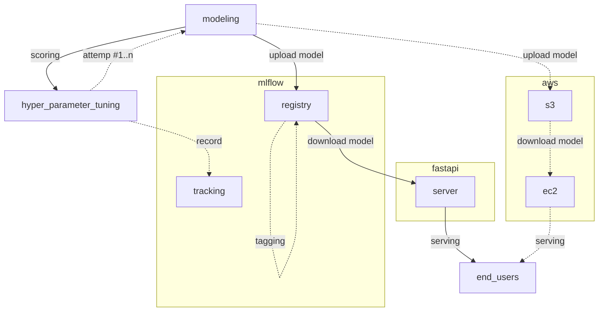

# upstage-ai-lab-day-48

## mlops
- 이해한 바로는 mlops 는 devops 와 다르지 않다
- ml 을 위한 특정 툴들을 다룬다
- 이를 위해 ml에 대한 있으면 좋다 정도가 다른 느낌
- 쓰이는 툴들은 대충 아래와 같다
  - [[fastapi]]
    - api 로 서빙을 위해 사용
  - [[mlflow]]
    - 하이퍼 파라메터 튜닝에 체계적인 도움을 주고, 모델을 레지스트리를 가지고 있어 모델을 관리를 제공한다
  - [[apache-airflow]]
    - [[@todo]]
    - 아마도 [[aws]] step-function 과 같이 task 의 연속적인 트리거 기능을 지원하는 것으로 추측 중
  - 그 외 [[aws]] sagemaker, kubeflow 등이 상황에 따라 검토 된다
- 이건 내 생각
  - 아마도 현업에 가면 동일한 devops 지만 model 을 서빙하는 것이 다를 것
  - model 을 서빙하기 때문에 gpu 에 대한 스케일링 처리해야하는 점이 다를 것

## flow
### [[mlflow]] 를 활용하여 모델링을 하는 경우
> 대충 느낌

## tool
> 쿠버네티스상에서 운영할 때는 적절한 대체제가 존재하는지 확인 필요
- [[mlflow]]
- [[fastapi]]
- [[apache-airflow]]

## link
- [[upstage-ai-lab]]
