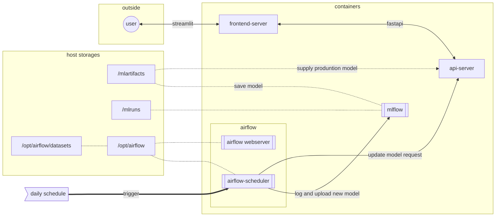
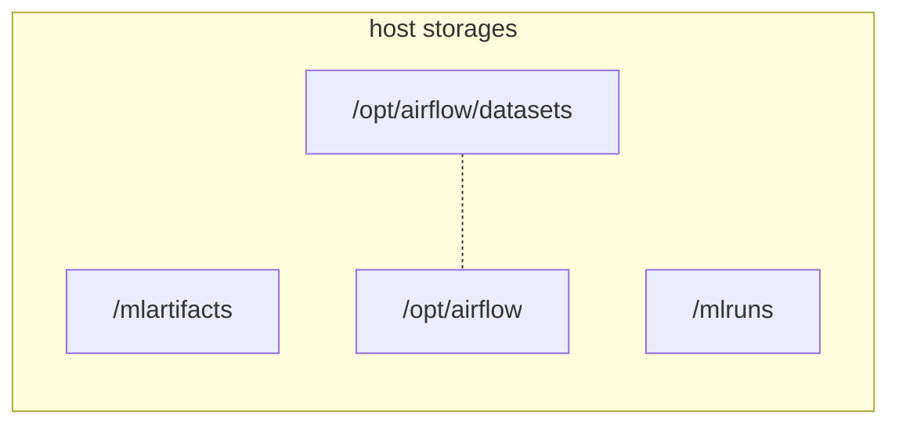
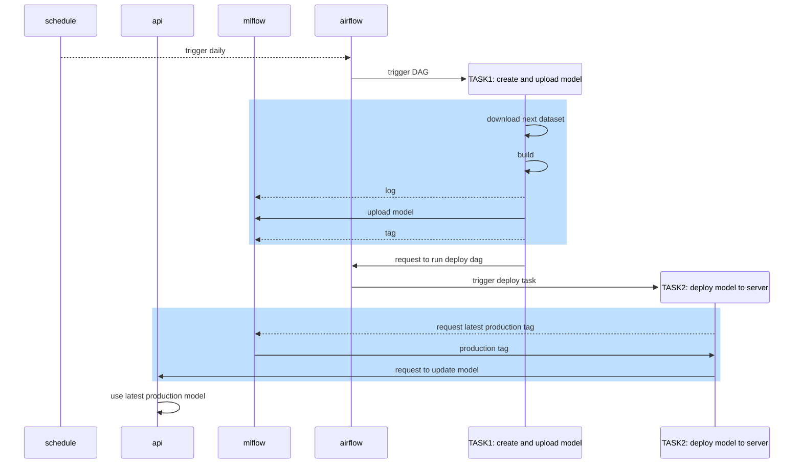

# mlops 프로젝트

## 개요
- 과목: mlops
- 주제: 영화 추천 시스템
- modeling 쪽으로 공부도 할 겸 할까 하였으나 infra 처리 가능 인력이 없는 것 같아서 ops 영역을 처리
  - 개인적으로도 이것 저것 시간 뜯기는 것들이 있어서 여유있게 익숙하면서도 배울 것이 있는 분야 선택
  - 프로젝트상으로도 ops를 main goal 로 인식, 팀원들의 인식과는 차이가 있는 느낌
- 수업은 다 듣고싶었으나 이전에 들었던과 중복이 많고 프로젝트에 집중이 필요하여 많이 못들음
  - 억지로 듣는것보다 손으로 하는게 더 남을 것 같은 느낌
- personal goal:
  - 뭐라도 유용한 새로운 것 경험
  - [X] mlops 를 경험
    - [X] [[mlflow]] 와 [[airflow]] 를 통해 modeling 부터 deploy 까지 전 cycle을 구현한다
    - [X] [[mlflow]]
      - [X] experiment 를 통해 log 심기
      - [X] model registry 를 활용하여 모델을 관리한다
        - [X] api 를 통한 동적 tag 제어
          - [X] 동적으로 *production* 버전을 관리한다
  - [X] [[docker-compose]] 로 개발 환경을 *local only* 구성
    - 이제까지는 [[kubernetes]] 홈 서버를 가지고 있기 때문에 [[docker-compose]] 를 그닥 활용하지 않았음
    - [X] 이참에 [[docker-compose]] 를 활용
      - [X] 팀원마다 개발에 대한 지식이 다르고 설치 자체가 장벽인 경우도 있음
      - [X] 개발인력으로 구성된 프로젝트가 아님
        - [X] [[docker-compose]] `up` 명령 하나로 환경 구축 목표
  - [X] [[fastapi]]
    - [X] [[python]] 의 가벼운 backend framework 경험
    - [X] 재시작없는 동적 model update 지원
  - [ ] 시간 남으면 팀원들이 작성한 modeling 검토
  - [X] ui 개발은 피한다
  - [X] crawling 은 피한다

## 계획
- personal
  - ~~kaggle dataset 을 그대로 사용하여 crawling 을 피한다~~
  - ~~airflow trigger 를 simulation 하기위해 ratings dataset 을 timestamp 로 분할하여 사용한다~~
    - dataset 을 timestamp 로 chunking 을 해두고 daily trigger 가 지정된 범위 dataset 을 크롤링 했다 가정
    - 점점 더 많은 dataset 으로 모델을 업데이트하고 api 서버에서 이를 동적으로 사용하는 것이 목표
  - [X] [[airflow]] 의 경우 계정 생성이 필요한데 팀원의 복잡한 과정을 없애기 위해 생성된 디비를 commit

## 흐름
### 구조



### 순서도

- flow 의 시작인 [[airflow]] trigger 가 daily trigger 라 **가정** 하고 수동 트리거
- [[airflow]]
  - DAG 실행
    - `TASK1:`
      - 순서에 맞는 dataset 을 가져옴
      - model(ALS) 생성
        - [[mlflow]] 에 parameter 및 model 저장
          - 최신 model 을 `production` tagging, 나머지는 `archived` tagging
    - `TASK2:`
      - `production` tag 가 붙은 방금 생성된 model 을 api 서버에 전달
- [[fastapi]] 서버
  - `TASK2` 의 request 를 받아 새로운 model 로 서빙중인 모델을 변경
  - 서버는 계속 모델을 서빙중

## 문제
- [[airflow]] ~~문제~~
  - [[kubernetes]] 환경이 아니다 보니 [[pod]] 로 독립된 컨테이너를 올릴 수 없어 DAG 을 실행하는 [[python]] script 의 모든 라이브러리를 담아야했음
    - 이를 위해서 [[airflow]] image + 사용 라이브러리를 담아 커스터 빌드해야 했음
    - 실제 환경에서는 [[kubernetes]] 관련 operator 가 사용될 것이므로 이는 **프로젝트 환경 특수**
- api server 에서 모델의 `pkl` 파일을 불러올때 DAG 에 사용된 [[python]] 파일에 종속이 걸려는 문제
  - [[mlflow]] 는 주류 라이브러리에 대해서 autolog 등 편의성을 제공
  - 사용 모델이 `implicit` 라이브러리를 사용하는 모델이라 비주류
  - [[diary:2024-10-11]] 시점 기준 `mlflow.pyfunc.log_model` 함수는 wrapper 를 요구
    - 때문에 wrapper 관련된 코드가 저장된 모델을 불러오는 쪽에서도 필요
      - 해당 위치는 api server 쪽
    - [X] code sharing 의 우아한 처리 고민은 프로젝트 여건상 아닌 것 같아 [[airflow]] 커스텀 이미지 빌드시에 관련 코드 함께 말아버림
    - 아래는 이해를 돕기 위한 코드
      ```python
      class ALSWrapper(mlflow.pyfunc.PythonModel):
          def __init__(self, model):
              self.model = model

          def load_context(self, context):
              pass

          def predict(self, context, model_input):
              return self.model.recommend(model_input)

      mlflow.pyfunc.log_model(
          f'{experiment_name}',
          # model 은 훈련을 마친 model
          python_model=ALSWrapper(model)
      )
      ```
- 제공해준 repo가 [[github]] quoto 문제가 있어 용량이 큰 dataset 을 업로드하지 문제로 개발에 많은 불편을 겪었다

## 회고
- 개인적으로 개발자 인력 없이는 뒷단 풀 구현이 쉽지 않을 것 같은 걱정으로 인프라 처리를 하게됨
  - 그래도 나름 배우는 것이 있었음
- 이후 프로젝트는 모두 모델링 메인일 것으로 생각됨
  - 모델링에 필요한 [[pandas]], [[numpy]], matplotlib 등에 대한 익숙도가 올라가고 있지만 내 손으로 해보는 경험이 적었음
  - 다음에는 이걸 채우는데 집중할 수 있도록 하자
- 백그라운드가 다른 사람들과 소통하면서 초반 커뮤니케이션을 확실하게 하지 못함
  - 이해 상태에 대해서 사람들이 말 할 것을 기대
    - 이해 상태를 지속적으로 sync 하는 노력이 현업보다 더 필요

## link
- [[upstage-ai-lab]]
- [[fastapi]]
- [[mlflow]]
- [[apache-airflow]]
- [[docker]]
- [[docker-compose]]
- [[upstage-ai-lab-project-02]]
- [[wn.private:upstage-ai-lab-project-03]]
